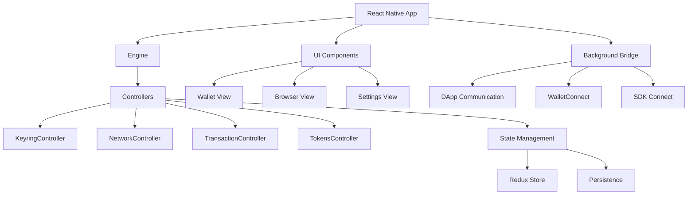

# MetaMask Mobile

[](https://github.com/MetaMask/metamask-mobile/actions/workflows/ci.yml)
[](https://github.com/MetaMask/metamask-mobile/actions/workflows/cla.yml)

> A self-custodial cryptocurrency wallet for iOS and Android that enables secure access to Web3
> applications and decentralized finance across multiple blockchain networks.

## Table of Contents

- [Quickstart](#quickstart)
- [Configuration](#configuration)
- [Usage](#usage)
- [Architecture](#architecture)
- [Development](#development)
- [Deployment](#deployment)
- [Troubleshooting](#troubleshooting)
- [Contributing](#contributing)
- [License](#license)

## Quickstart

### Prerequisites

- OS: macOS (for iOS development), Linux, or Windows
- Runtime: Node.js 20.18.0, Ruby 3.1.6, Yarn 1.22.22
- Tools: Xcode (iOS), Android Studio (Android), Git

### Setup

```bash
$ git clone https://github.com/COG-GTM/metamask-mobile.git
$ cd metamask-mobile
$ nvm use 20.18.0
$ yarn setup
```

### Quick Start with Expo (Recommended)

```bash
$ yarn setup:expo
$ yarn watch
```

### Native Development

```bash
# iOS (macOS only)
$ yarn start:ios

# Android
$ yarn start:android
```

### Verify

```bash
$ yarn test:unit
$ yarn lint
```

## Configuration

### Environment Variables

| Name | Required | Default | Description |
| --- | --- | --- | --- |
| METAMASK_BUILD_TYPE | No | — | Build variant (flask, beta, release) |
| GOOGLE_SERVICES_B64_ANDROID | Yes* | — | Base64 encoded google-services.json |
| GOOGLE_SERVICES_B64_IOS | Yes* | — | Base64 encoded GoogleService-Info.plist |
| NODE_OPTIONS | No | — | Node.js runtime options |

*Required for Firebase messaging functionality

### Configuration Files

The app uses multiple environment files:

- `.js.env` - JavaScript environment variables
- `.ios.env` - iOS-specific configuration
- `.android.env` - Android-specific configuration
- `.e2e.env` - End-to-end testing configuration

Example files are provided with `.example` extensions. Run `yarn setup` to copy them
automatically.

## Usage

### Development Commands

```bash
# Start Metro bundler
$ yarn watch

# Clean and restart bundler
$ yarn watch:clean

# Build for specific platforms
$ yarn start:ios
$ yarn start:android

# Run with specific build types
$ yarn start:ios:flask
$ yarn start:android:qa
```

### Testing Commands

```bash
# Run all unit tests
$ yarn test:unit

# Run specific test file
$ yarn jest <path-to-test-file>

# Update test snapshots
$ yarn test:unit:update

# Run E2E tests
$ yarn test:e2e:ios:run:qa-release
$ yarn test:e2e:android:run:qa-release
```

### Code Quality

```bash
# Lint JavaScript/TypeScript
$ yarn lint
$ yarn lint:fix

# Type checking
$ yarn lint:tsc

# Format code
$ yarn format
```

## Architecture



### Key Components

- **Engine**: Core orchestration system that manages controllers
- **Controllers**: Modular components handling specific wallet functionality
- **Background Bridge**: Facilitates communication between dApps and wallet
- **UI Layer**: React Native components organized by feature
- **State Management**: Redux-based state with persistence

For detailed architecture documentation, see [Architecture Guide](./docs/readme/architecture.md).

## Development

### Local Development Setup

```bash
# Install dependencies
$ yarn setup

# For Expo development (faster iteration)
$ yarn setup:expo

# Install iOS dependencies (macOS only)
$ yarn gem:bundle:install
$ yarn pod:install

# Clean builds
$ yarn clean
$ yarn clean:ios
$ yarn clean:android
```

### Build Commands

```bash
# Development builds
$ yarn build:android:devbuild
$ yarn build:ios:devbuild

# Release builds
$ yarn build:android:release
$ yarn build:ios:release

# Generate bundles
$ yarn gen-bundle:ios
$ yarn gen-bundle:android
```

### Testing

The project includes comprehensive test coverage:

- **Unit Tests**: Jest-based tests for components and utilities
- **E2E Tests**: Detox-based end-to-end testing
- **Integration Tests**: API specification testing

```bash
# Run all tests
$ yarn test

# Run tests with coverage
$ yarn test:unit --coverage

# Run dependency checks
$ yarn test:depcheck

# Validate test coverage thresholds
$ yarn test:validate-coverage
```

### Code Standards

- Follow [Coding Guidelines](https://github.com/MetaMask/metamask-mobile/blob/main/.github/guidelines/CODING_GUIDELINES.md)
- Use TypeScript for new components
- Maintain test coverage above thresholds
- Run linting and formatting before commits

## Deployment

### Docker Development

```bash
# Build development container
$ docker build -f scripts/docker/Dockerfile .

# The container includes:
# - Node.js 20 with Yarn 1.22.22
# - Ruby 3.1.6 with rbenv
# - iOS/Android build dependencies
```

### Mobile App Stores

- **iOS**: Built via Bitrise CI/CD, deployed to App Store Connect
- **Android**: Built via Bitrise CI/CD, deployed to Google Play Console

### Build Artifacts

- iOS: `.ipa` files for device installation, `.app` for simulator
- Android: `.apk` files for direct installation, `.aab` for Play Store

### Environment-Specific Builds

```bash
# QA builds
$ yarn build:android:qa
$ yarn build:ios:qa

# Flask (development) builds
$ yarn build:android:pre-release:bundle:flask
$ yarn build:ios:pre-flask

# Beta builds
$ yarn build:android:pre-release:bundle:beta
$ yarn build:ios:pre-beta
```

## Troubleshooting

### Common Issues

### Build Failures

- Ensure Node.js 20.18.0 is active: `nvm use 20.18.0`
- Clean and reinstall: `yarn clean && yarn setup`
- For iOS: `yarn clean:ios && yarn pod:install`

### Metro Bundler Issues

- Reset Metro cache: `yarn watch:clean`
- Clear React Native cache: `npx react-native start --reset-cache`

### Environment Setup

- Copy environment files: `cp .js.env.example .js.env`
- Verify Firebase configuration files are present
- Check Ruby/Node versions match requirements

### Testing Issues

- Update snapshots: `yarn test:unit:update`
- Clear Jest cache: `yarn jest --clearCache`

For detailed troubleshooting, see [Build Troubleshooting Guide](./docs/readme/troubleshooting.md).

### Getting Help

- Check [existing issues](https://github.com/MetaMask/metamask-mobile/issues)
- Review [debugging guide](./docs/readme/debugging.md)
- Contact: mobile@metamask.io

## Contributing

We welcome contributions! Please see our [Contributing Guide](./.github/CONTRIBUTING.md) for details.

### Quick Contribution Steps

1. Fork the repository
2. Create a feature branch: `git checkout -b feature/your-feature`
3. Follow our [coding guidelines](https://github.com/MetaMask/metamask-mobile/blob/main/.github/guidelines/CODING_GUIDELINES.md)
4. Add tests for new functionality
5. Update CHANGELOG.md
6. Submit a pull request against `main`

### Development Resources

- [Architecture Documentation](./docs/readme/architecture.md)
- [Environment Setup](./docs/readme/environment.md)
- [Testing Guide](./docs/readme/testing.md)
- [Debugging Guide](./docs/readme/debugging.md)
- [Storybook](./docs/readme/storybook.md)

## License

### Custom ConsenSys License

MetaMask Mobile source code is viewable for inspection and study purposes. The code is
provided under a limited license that allows inspection and study but restricts
reproduction and derivative works without prior consent.

© ConsenSys Software Inc, 2021.

You are granted a limited non-exclusive license to inspect and study the code in this
repository. There is no associated right to reproduction granted under this license except where
reproduction is necessary for inspection and study of the code. You may not otherwise reproduce,
distribute, modify or create derivative works of the code without our prior consent. All other
rights are expressly reserved.

For questions about licensing, contact: mobile@metamask.io

## Additional Resources

For more detailed information, see the following documentation:

- [Architecture Guide](./docs/readme/architecture.md)
- [Expo Development Environment Setup](./docs/readme/expo-environment.md)
- [Native Development Environment Setup](./docs/readme/environment.md)
- [Build Troubleshooting Guide](./docs/readme/troubleshooting.md)
- [Testing Guide](./docs/readme/testing.md)
- [Debugging Guide](./docs/readme/debugging.md)
- [API Call Logging for Debugging](./docs/readme/api-logging.md)
- [Storybook Documentation](./docs/readme/storybook.md)
- [Miscellaneous Information](./docs/readme/miscellaneous.md)
- [E2E Testing Segment Events](./docs/testing/e2e/segment-events.md)
