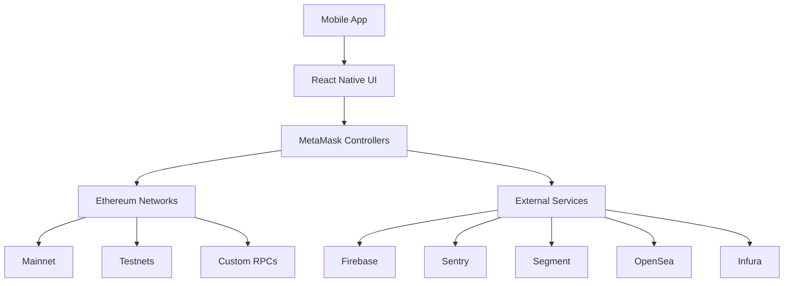

# MetaMask Mobile

[](https://github.com/MetaMask/metamask-mobile/actions/workflows/ci.yml) [](https://github.com/MetaMask/metamask-mobile/actions/workflows/cla.yml) [](LICENSE)

> MetaMask is a mobile wallet that provides easy access to websites that use the [Ethereum](https://ethereum.org/) blockchain. Built with React Native, it offers a secure and user-friendly interface for managing digital assets and interacting with decentralized applications.

## Table of Contents

- [Quickstart](#quickstart)
- [Configuration](#configuration)
- [Usage](#usage)
- [Architecture](#architecture)
- [Development](#development)
- [Testing](#testing)
- [Deployment](#deployment)
- [Troubleshooting](#troubleshooting)
- [Contributing](#contributing)
- [License](#license)

## Quickstart

### Prerequisites

- **OS**: macOS, Linux, or Windows
- **Runtime**: Node.js 20.18.0, Yarn 1.22.22
- **Mobile Development**:
  - For iOS: Xcode, Ruby 3.1.6, CocoaPods
  - For Android: Android Studio, Java 17+
- **Tools**: Git, Watchman (recommended)

### Setup

```bash
$ git clone https://github.com/COG-GTM/metamask-mobile.git
$ cd metamask-mobile
$ nvm use 20.18.0
$ yarn setup:expo
```

### Run the App

```bash
# Start Metro bundler
$ yarn watch

# In separate terminals:
# For iOS (requires Xcode)
$ yarn start:ios

# For Android (requires Android Studio)
$ yarn start:android
```

### Verify Installation

```bash
$ yarn lint
$ yarn test:unit --maxWorkers=1
```

## Configuration

### Required Environment Variables

| Name | Required | Default | Description |
| --- | --- | --- | --- |
| `GOOGLE_SERVICES_B64_ANDROID` | Yes | — | Base64 encoded Google Services JSON for Android Firebase |
| `GOOGLE_SERVICES_B64_IOS` | Yes | — | Base64 encoded Google Services plist for iOS Firebase |

### Optional Environment Variables

| Name | Required | Default | Description |
| --- | --- | --- | --- |
| `MM_PUBNUB_SUB_KEY` | No | — | PubNub subscription key for real-time messaging |
| `MM_PUBNUB_PUB_KEY` | No | — | PubNub publish key for real-time messaging |
| `MM_OPENSEA_KEY` | No | — | OpenSea API key for NFT data |
| `MM_INFURA_PROJECT_ID` | No | `null` | Infura project ID for Ethereum network access |
| `MM_SENTRY_DSN` | No | — | Sentry DSN for error tracking |
| `WALLET_CONNECT_PROJECT_ID` | No | — | WalletConnect v2 project ID |
| `BLOCKAID_FILE_CDN` | No | — | CDN URL for Blockaid security files |
| `SEGMENT_WRITE_KEY` | No | — | Segment analytics write key |
| `METAMASK_BUILD_TYPE` | No | `main` | Build variant: `main`, `flask`, or `beta` |
| `METAMASK_ENVIRONMENT` | No | `local` | Environment: `local`, `pre-release`, or `production` |

### Environment Setup

1. Copy environment templates:

   ```bash
   $ cp .js.env.example .js.env
   $ cp .android.env.example .android.env
   $ cp .ios.env.example .ios.env
   ```

2. Fill in required values in each `.env` file
3. Rebuild the app after environment changes

## Usage

### Development Commands

```bash
# Start development server
$ yarn watch

# Platform-specific builds
$ yarn start:ios          # iOS debug build
$ yarn start:android      # Android debug build
$ yarn start:ios:device   # iOS build for physical device

# Build variants
$ yarn setup:flask        # Flask (beta) variant setup
$ yarn start:ios:flask    # iOS Flask build
$ yarn start:android:flask # Android Flask build
```

### Production Builds

```bash
# iOS production build
$ yarn build:ios:release

# Android production build  
$ yarn build:android:release

# Generate checksums (Android)
$ yarn build:android:checksum
```

### API Examples

The app connects to various blockchain networks and services:

```bash
# Test network connectivity
$ curl -X POST https://mainnet.infura.io/v3/YOUR_PROJECT_ID \
  -H "Content-Type: application/json" \
  -d '{"jsonrpc":"2.0","method":"eth_blockNumber","params":[],"id":1}'
```

## Architecture



**Key Components:**

- **Engine**: Core MetaMask controller orchestration
- **UI Layer**: React Native components and navigation
- **Network Layer**: Ethereum JSON-RPC communication
- **Security**: Keyring management and transaction signing
- **Services**: Analytics, error reporting, and external APIs

For detailed architecture information, see [Architecture Documentation](./docs/readme/architecture.md).

## Development

### Setup Development Environment

#### Using Expo (Recommended)

```bash
$ yarn setup:expo
$ yarn watch
```

#### Native Development

```bash
$ yarn setup
$ yarn start:ios    # or yarn start:android
```

### Code Quality

```bash
# Linting
$ yarn lint
$ yarn lint:fix
$ yarn lint:tsc

# Formatting
$ yarn format

# Dependency checks
$ yarn test:depcheck
```

### Development Tools

```bash
# Start Flipper debugger
$ yarn start:flipper

# Generate app icons
$ yarn generate-icons

# Storybook (component library)
$ yarn prestorybook
$ yarn storybook-watch
```

## Testing

### Unit Tests

```bash
# Run all unit tests
$ yarn test:unit

# Run specific test file
$ yarn jest path/to/test-file.test.js

# Update snapshots
$ yarn test:unit:update

# Test coverage
$ yarn test:merge-coverage
```

### End-to-End Tests

```bash
# Setup E2E environment
$ yarn setup:e2e

# iOS E2E tests
$ yarn test:e2e:ios:build:qa-release
$ yarn test:e2e:ios:run:qa-release

# Android E2E tests  
$ yarn test:e2e:android:build:qa-release
$ yarn test:e2e:android:run:qa-release

# WebDriver tests
$ yarn test:wdio:ios
$ yarn test:wdio:android
```

### Performance Testing

```bash
# Bundle size analysis
$ yarn gen-bundle:ios
$ yarn gen-bundle:android

# Circular dependency check
$ yarn circular:deps
```

## Deployment

### Mobile App Stores

#### iOS App Store

- Build: `yarn build:ios:release`
- Archive and upload via Xcode
- Requires Apple Developer account

#### Google Play Store

- Build: `yarn build:android:release`
- Generate signed APK/AAB
- Upload via Google Play Console

### Docker Development

```bash
# Build development container
$ docker build -f scripts/docker/Dockerfile -t metamask-mobile .

# Run container
$ docker run -it -v $(pwd):/app metamask-mobile
```

**Container Details:**

- Base: Node.js 20 on Debian Bookworm
- Includes: Ruby 3.1.6, rbenv, bundler, CocoaPods
- Ports: 8081 (Metro bundler)
- Health: Metro server status

## Troubleshooting

### Common Issues

#### Metro bundler fails to start

- **Cause**: Port 8081 already in use
- **Fix**: `yarn watch:clean && yarn watch`

#### iOS build fails with CocoaPods errors

- **Cause**: Outdated pods or Ruby version mismatch  
- **Fix**: `cd ios && bundle exec pod install`

#### Android build fails with Gradle errors

- **Cause**: Incorrect Java version or Android SDK setup
- **Fix**: Ensure Java 17+ and Android SDK 34+ are installed

#### Environment variables not loading

- **Cause**: Missing or incorrectly named `.env` files
- **Fix**: Verify `.js.env`, `.android.env`, `.ios.env` exist and have correct format

#### Firebase configuration missing

- **Cause**: `GOOGLE_SERVICES_B64_*` variables not set
- **Fix**: Obtain Firebase config files and encode as base64

### Performance Issues

#### Slow startup on device

- Enable Hermes engine (enabled by default)
- Check for large bundle size: `yarn gen-bundle:ios`

#### Memory issues during development

- Increase Node.js memory: `export NODE_OPTIONS="--max_old_space_size=8192"`
- Use fewer test workers: `yarn test:unit --maxWorkers=1`

### Getting Help

1. Check [existing issues](https://github.com/COG-GTM/metamask-mobile/issues)
2. Review [troubleshooting docs](./docs/readme/troubleshooting.md)
3. Ask in [MetaMask Discord](https://discord.gg/metamask)
4. Create a [new issue](https://github.com/MetaMask/metamask-mobile/issues/new) with:
   - Environment details (OS, Node version, etc.)
   - Steps to reproduce
   - Error logs and screenshots

## Contributing

We welcome contributions! Please see [CONTRIBUTING.md](.github/CONTRIBUTING.md) for guidelines.

**Quick Start for Contributors:**

1. Fork the repository
2. Create a feature branch: `git checkout -b feature/your-feature`
3. Follow our [coding guidelines](.github/guidelines/CODING_GUIDELINES.md)
4. Add tests for new functionality
5. Update [CHANGELOG.md](CHANGELOG.md)
6. Submit a pull request

**Development Resources:**

- [Architecture](./docs/readme/architecture.md)
- [Expo Development Environment](./docs/readme/expo-environment.md)
- [Native Development Environment](./docs/readme/environment.md)
- [Testing Guide](./docs/readme/testing.md)
- [Debugging](./docs/readme/debugging.md)
- [API Logging](./docs/readme/api-logging.md)
- [Storybook](./docs/readme/storybook.md)
- [E2E Testing](./docs/testing/e2e/segment-events.md)

## License

© ConsenSys Software Inc, 2021. All rights reserved.

This project is licensed under a custom license. See [LICENSE](LICENSE) for details.

---

**External Links:**

- [MetaMask Website](https://metamask.io)
- [Developer Documentation](https://docs.metamask.io)
- [Twitter](https://twitter.com/metamask) | [Medium](https://medium.com/metamask)
- [Contributor Docs](https://github.com/MetaMask/contributor-docs)

## Getting started

### Using Expo (recommended)

Expo is the fastest way to start developing. With the Expo framework, developers don't need to compile the native side of the application as before, hence no need for any native environment setup, developers only need to download a precompiled development build and run the javascript bundler. The development build will then connect with the bundler to load the javascript code.

#### Expo Environment Setup

[Install node, yarn and watchman.](./docs/readme/expo-environment.md)

#### Clone the project

```bash
git clone git@github.com:MetaMask/metamask-mobile.git && \
cd metamask-mobile
```

#### Install dependencies

```bash
yarn setup:expo
```

#### Run the bundler

```bash
yarn watch
```

#### Download and install the development build

- Expo development builds are hosted in [Runway](https://www.runway.team/) buckets and are made available to all contributors through the public bucket links below. A new build is generated every time a PR is merged into the `main` branch.

- For Android:
  - Download and install an `.apk` file from this [Runway bucket](https://app.runway.team/bucket/hykQxdZCEGgoyyZ9sBtkhli8wupv9PiTA6uRJf3Lh65FTECF1oy8vzkeXdmuJKhm7xGLeV35GzIT1Un7J5XkBADm5OhknlBXzA0CzqB767V36gi1F3yg3Uss) onto your Android device or emulator.
- For iOS:
  - Physical device
    - Your test device needs to first be registered with our Apple developer account.
    - Once registered, download and install an `.ipa` file from this [Runway bucket](https://app.runway.team/bucket/MV2BJmn6D5_O7nqGw8jHpATpEA4jkPrBB4EcWXC6wV7z8jgwIbAsDhE5Ncl7KwF32qRQQD9YrahAIaxdFVvLT4v3UvBcViMtT3zJdMMfkXDPjSdqVGw=) onto your device.
  - Simulator
    - Download and install an `.app` file from this [Runway bucket](https://app.runway.team/bucket/aCddXOkg1p_nDryri-FMyvkC9KRqQeVT_12sf6Nw0u6iGygGo6BlNzjD6bOt-zma260EzAxdpXmlp2GQphp3TN1s6AJE4i6d_9V0Tv5h4pHISU49dFk=) onto your simulator.
    - Note: Our `.app` files are zipped and hosted under `Additional Artifacts` in the bucket. Since this hosting additional artifacts in public buckets is a relatively new feature, contributors may find that some builds are missing additional artifacts. Under the hood, these are usually associated with failed or aborted Bitrise builds. We are working with the Runway team to better filter out these builds and are subject to change in the future.

#### Load the app

If on a simulator:

- use the initial expo screen that appears when starting the development to choose the bundler url
- OR press "a" for Android or "i" for iOS on the terminal where the bundler is running

If on a physical device:

- Use the camera app to scan the QR code presented by the bundler running on the terminal

That's it! This will work for any javascript development, if you need to develop or modify native code please see the next section.

### Native Development

If developing or modifying native code or installing any library that introduces or uses native code, it is not possible to use an Expo precompiled development build as you need to compile the native side of the application again. To do so, please follow the steps stated in this section.

#### Native Environment setup

Before running the app for native development, make sure your development environment has all the required tools. Several of these tools (ie Node and Ruby) may require specific versions in order to successfully build the app.

[Setup your development environment](./docs/readme/environment.md)

#### Building the app

**Clone the project**

```bash
git clone git@github.com:MetaMask/metamask-mobile.git && \
cd metamask-mobile
```

##### Firebase Messaging Setup

MetaMask uses Firebase Cloud Messaging (FCM) to enable app communications. To integrate FCM, you'll need configuration files for both iOS and Android platforms.

###### Internal Contributor instructions

1. Grab the `.js.env` file from 1Password, ask around for the correct vault. This file contains the `GOOGLE_SERVICES_B64_ANDROID` and `GOOGLE_SERVICES_B64_IOS` secrets that will be used to generate the relevant configuration files for IOS/Android.
2. [Install](./README.md#install-dependencies) and [run & start](./README.md#running-the-app) the application as documented below.

###### External Contributor instructions

As an external contributor, you need to provide your own Firebase project configuration files:

- **`GoogleService-Info.plist`** (iOS)
- **`google-services.json`** (Android)

1. Create a Free Firebase Project
   - Set up a Firebase project in the Firebase Console.
   - Configure the project with a client package name matching `io.metamask` (IMPORTANT).
2. Add Configuration Files
   - Create/Update the `google-services.json` and `GoogleService-Info.plist` files in:
   - `android/app/google-services.json` (for Android)
   - `ios/GoogleServices/GoogleService-Info.plist` directory (for iOS)
3. Create the correct base64 environments variables.

```bash
# Generate Android Base64 Version of Google Services
export GOOGLE_SERVICES_B64_ANDROID="$(base64 -w0 -i ./android/app/google-services.json)" && echo "export GOOGLE_SERVICES_B64_ANDROID=\"$GOOGLE_SERVICES_B64_ANDROID\"" | tee -a .js.env

# Generate IOS Base64 Version of Google Services
export GOOGLE_SERVICES_B64_IOS="$(base64 -w0 -i ./ios/GoogleServices/GoogleService-Info.plist)" && echo "export GOOGLE_SERVICES_B64_IOS=\"$GOOGLE_SERVICES_B64_IOS\"" | tee -a .js.env
```

[!CAUTION]

> In case you don't provide your own Firebase project config file or run the steps above, you will face the error `No matching client found for package name 'io.metamask'`.

In case of any doubt, please follow the instructions in the link below to get your Firebase project config file.
[Firebase Project Quickstart](https://firebaseopensource.com/projects/firebase/quickstart-js/messaging/readme/#getting_started)

##### Install dependencies

```bash
yarn setup
```

_Not the usual install command, this will run scripts and a lengthy postinstall flow_

#### Running the app for native development

**Run Metro bundler**

```bash
yarn watch
```

_Like a local server for the app_

**Run on a iOS device**

```bash
yarn start:ios
```

**Run on an Android device**

```bash
yarn start:android
```
