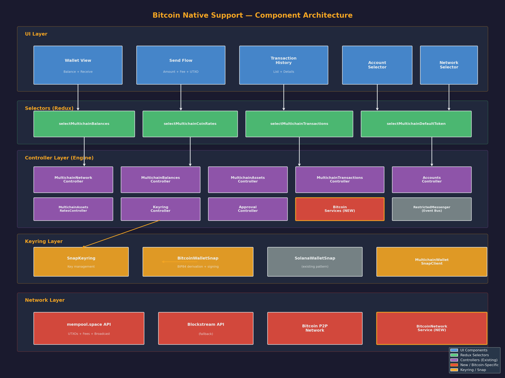
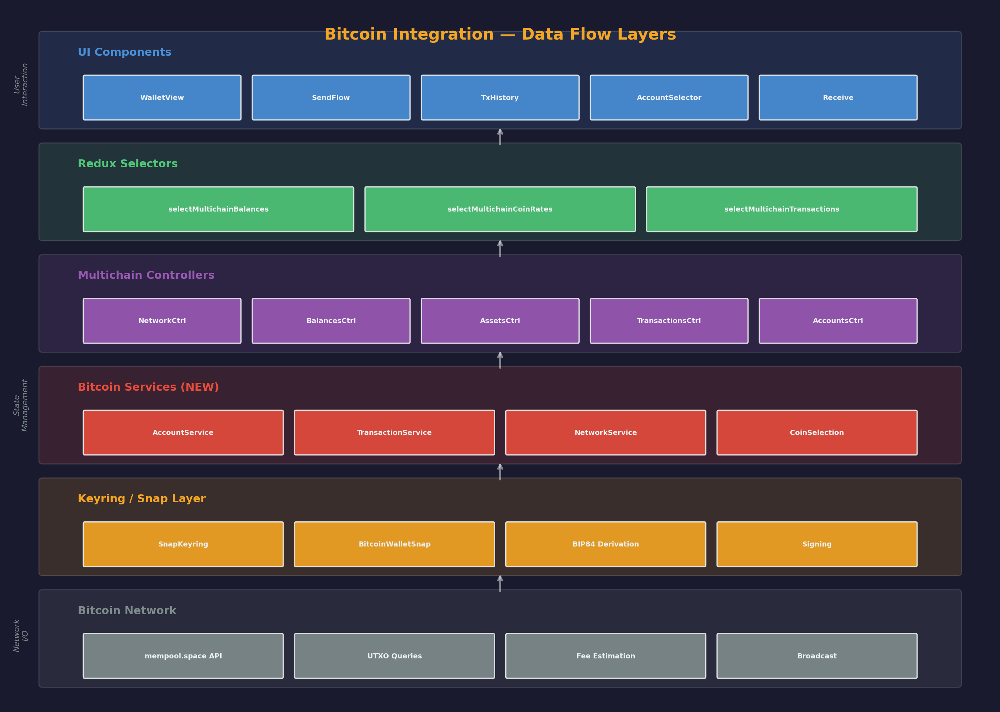
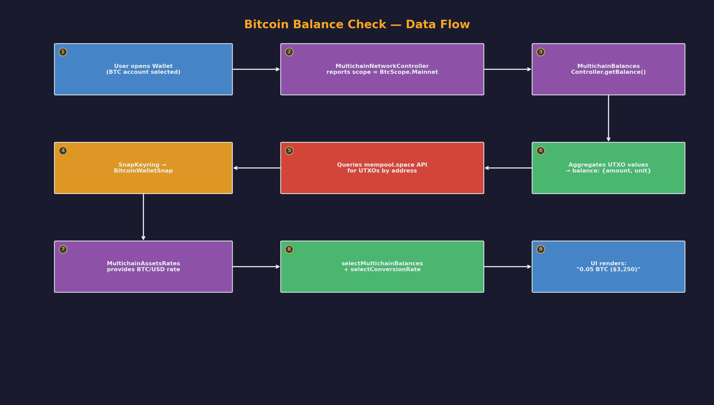
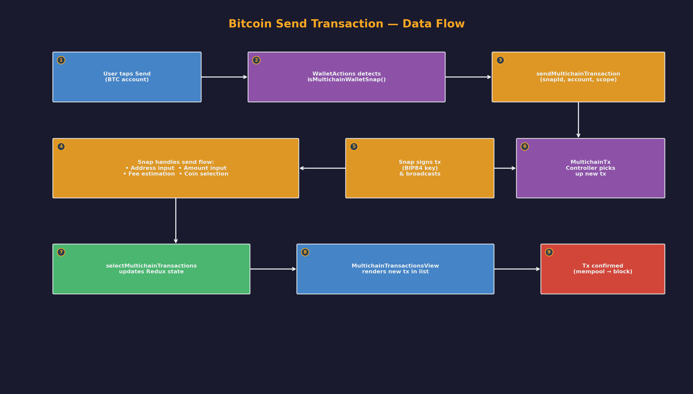

# Bitcoin Native Support — Architecture Document

> **Phase 0 — Team A (Architecture)**
> Defines interfaces, contracts, and integration points for adding native Bitcoin support to MetaMask Mobile.

---

## Table of Contents

1. [Executive Summary](#1-executive-summary)
2. [Current Architecture Overview](#2-current-architecture-overview)
3. [Bitcoin Domain Model](#3-bitcoin-domain-model)
4. [Component Architecture](#4-component-architecture)
5. [Interface Definitions](#5-interface-definitions)
6. [Data Flow Diagrams](#6-data-flow-diagrams)
7. [Integration Points with Existing Controllers](#7-integration-points-with-existing-controllers)
8. [Migration & Adoption Strategy](#8-migration--adoption-strategy)
9. [Open Questions & Risks](#9-open-questions--risks)

---

## 1. Executive Summary

This document defines the architecture for adding native Bitcoin (BTC) support to MetaMask Mobile. Bitcoin uses a fundamentally different model from Ethereum: it is UTXO-based (not account-based), supports multiple address formats (Legacy, SegWit, Taproot), and requires different key derivation paths (BIP44/49/84/86).

**Current state**: MetaMask Mobile already has partial Bitcoin support through the `@metamask/bitcoin-wallet-snap` Snap, integrated via the `SnapKeyring`. The multichain controller infrastructure (`MultichainNetworkController`, `MultichainBalancesController`, `MultichainAssetsController`, `MultichainTransactionsController`) is in place and handles Bitcoin alongside Solana.

**This document defines**: The TypeScript interfaces, controller contracts, and data flows needed to evolve from Snap-delegated Bitcoin support to a fully native implementation, while preserving backward compatibility with the existing Snap-based approach during the transition.

### Key Design Decisions

| Decision | Rationale |
|----------|-----------|
| Reuse existing multichain controller infrastructure | `MultichainNetworkController`, `MultichainBalancesController`, etc. already abstract non-EVM chains. Bitcoin plugs into this abstraction. |
| Keep Snap keyring as the key derivation backend | The `@metamask/bitcoin-wallet-snap` handles BIP84 derivation securely. Native controllers consume derived keys/addresses, they don't derive them. |
| UTXO model types are separate from Ethereum transaction types | Bitcoin's input/output model is structurally different. Trying to reuse `TransactionController` types would leak Ethereum assumptions. |
| P2WPKH (Native SegWit, BIP84) as default address type | Matches existing `BtcAccountType.P2wpkh` from `@metamask/keyring-api`. Best balance of compatibility and fee efficiency. |
| Feature-flag gated (`keyring-snaps`) | Follows existing pattern — all multichain controllers are behind `///: BEGIN:ONLY_INCLUDE_IF(keyring-snaps)`. |

---

## 2. Current Architecture Overview

### 2.1 Engine & Controller Pattern

MetaMask Mobile uses a **central Engine singleton** (`app/core/Engine/Engine.ts`) that:

1. Creates a `BaseControllerMessenger` (extended from `@metamask/base-controller`)
2. Instantiates all controllers, giving each a **restricted messenger** scoped to their allowed actions/events
3. Composes them into a `ComposableController` for unified state management
4. Exposes the controller instances via `Engine.context`

```
Engine (Singleton)
  ├── controllerMessenger: BaseControllerMessenger
  ├── context: EngineContext (all controller instances)
  └── datamodel: ComposableController<EngineState>
        ├── AccountsController
        ├── KeyringController
        ├── NetworkController
        ├── TransactionController
        ├── MultichainNetworkController
        ├── MultichainBalancesController  (keyring-snaps)
        ├── MultichainAssetsController    (keyring-snaps)
        ├── MultichainTransactionsController (keyring-snaps)
        └── ... (30+ controllers)
```

### 2.2 Controller Init Pattern

New controllers follow a modular init pattern (`app/core/Engine/controllers/`):

```typescript
// Example: multichain-network-controller-init.ts
export const multichainNetworkControllerInit: ControllerInitFunction<
  MultichainNetworkController,
  MultichainNetworkControllerMessenger
> = (request) => {
  const { controllerMessenger, persistedState } = request;
  const controller = new MultichainNetworkController({
    messenger: controllerMessenger,
    state: persistedState.MultichainNetworkController,
  });
  return { controller };
};
```

Each controller also has a messenger factory registered in `app/core/Engine/messengers/index.ts`:

```typescript
export const CONTROLLER_MESSENGERS = {
  MultichainNetworkController: {
    getMessenger: getMultichainNetworkControllerMessenger,
    getInitMessenger: noop,
  },
  // ...
};
```

### 2.3 Existing Bitcoin Support (Snap-Based)

The current Bitcoin integration works through:

| Component | Location | Role |
|-----------|----------|------|
| `BitcoinWalletSnap` | `app/core/SnapKeyring/BitcoinWalletSnap.ts` | Snap sender — routes keyring requests to the Bitcoin Snap |
| `BitcoinWalletSnapClient` | `app/core/SnapKeyring/MultichainWalletSnapClient.ts` | Client wrapping Snap for account creation & discovery |
| `MultichainWalletSnapFactory` | Same file | Factory creating Bitcoin/Solana clients |
| `sendMultichainTransaction()` | `app/core/SnapKeyring/utils/sendMultichainTransaction.ts` | Initiates send flow via Snap RPC (`startSendTransactionFlow`) |
| Multichain Utils | `app/core/Multichain/utils.ts` | Address validation, type checking (`isBtcAccount`, `isBtcMainnetAddress`) |
| Multichain Constants | `app/core/Multichain/constants.ts` | Network images, block explorer URLs, account type mappings |
| Multichain Selectors | `app/selectors/multichain/multichain.ts` | Redux selectors for balances, rates, tokens |

### 2.4 Component Diagram



*See `docs/assets/bitcoin-architecture-components.png` for the full component diagram.*

---

## 3. Bitcoin Domain Model

### 3.1 UTXO vs Account Model

| Aspect | Ethereum (Account) | Bitcoin (UTXO) |
|--------|-------------------|----------------|
| Balance | Single number per address | Sum of all UTXOs across all addresses |
| Addresses | One address per account | Many addresses per account (HD derivation) |
| Sending | Deduct from balance, increment nonce | Consume UTXOs as inputs, create new UTXOs as outputs |
| Fees | Gas price × gas used | Fee rate (sat/vB) × transaction virtual size |
| Change | None (exact deduction) | Explicit change output back to sender |
| Privacy | Address reuse common | New address per transaction recommended |

### 3.2 Address Types

Bitcoin supports multiple address formats, each with different fee characteristics:

| Type | BIP | Prefix (Mainnet) | Prefix (Testnet) | SegWit | Description |
|------|-----|-------------------|-------------------|--------|-------------|
| P2PKH | 44 | `1...` | `m...` / `n...` | No | Legacy — highest fees |
| P2SH-P2WPKH | 49 | `3...` | `2...` | Yes (wrapped) | Nested SegWit — backward compatible |
| **P2WPKH** | **84** | **`bc1q...`** | **`tb1q...`** | **Yes** | **Native SegWit — default** |
| P2WSH | 84 | `bc1q...` (longer) | `tb1q...` | Yes | Script hash variant |
| P2TR | 86 | `bc1p...` | `tb1p...` | Yes | Taproot — best privacy & efficiency |

**Default**: P2WPKH (Native SegWit, BIP84) — matches existing `BtcAccountType.P2wpkh`.

### 3.3 Key Derivation Paths

```
Master Seed (SRP — shared with Ethereum)
  │
  ├── m/44'/60'/0'/0/...   ← Ethereum (existing)
  │
  ├── m/84'/0'/0'/0/...    ← Bitcoin Native SegWit (P2WPKH) — DEFAULT
  ├── m/84'/0'/0'/1/...    ← Bitcoin change addresses
  │
  ├── m/44'/0'/0'/0/...    ← Bitcoin Legacy (P2PKH)
  ├── m/49'/0'/0'/0/...    ← Bitcoin Nested SegWit (P2SH)
  └── m/86'/0'/0'/0/...    ← Bitcoin Taproot (P2TR)
```

For testnet, coin type changes from `0'` to `1'` (e.g., `m/84'/1'/0'/0/...`).

---

## 4. Component Architecture

### 4.1 Layer Diagram



*See `docs/assets/bitcoin-architecture-layers.png` for the full layer diagram.*

```
┌─────────────────────────────────────────────────────────────────┐
│                        UI Layer                                  │
│  ┌──────────────┐ ┌──────────────┐ ┌──────────────────────────┐ │
│  │ Wallet View  │ │  Send Flow   │ │  Transaction History     │ │
│  │ (balance,    │ │ (amount,     │ │  (MultichainTransaction  │ │
│  │  receive     │ │  address,    │ │   ListView/Details)      │ │
│  │  addr)       │ │  fee, UTXO)  │ │                          │ │
│  └──────┬───────┘ └──────┬───────┘ └──────────┬───────────────┘ │
│         │                │                     │                 │
├─────────┼────────────────┼─────────────────────┼─────────────────┤
│         │         Selectors Layer               │                │
│  ┌──────┴──────────────────┴────────────────────┴──────────┐    │
│  │  app/selectors/multichain/multichain.ts                  │    │
│  │  ├── selectMultichainBalances                            │    │
│  │  ├── selectMultichainCoinRates                           │    │
│  │  ├── selectMultichainTransactions                        │    │
│  │  └── selectMultichainDefaultToken                        │    │
│  └──────────────────────────┬──────────────────────────────┘    │
│                              │                                   │
├──────────────────────────────┼───────────────────────────────────┤
│                       Controller Layer                           │
│  ┌──────────────────────────┴──────────────────────────────┐    │
│  │              Existing Multichain Controllers              │    │
│  │  ┌─────────────────────┐ ┌────────────────────────────┐  │    │
│  │  │ MultichainNetwork   │ │ MultichainBalances          │  │    │
│  │  │ Controller          │ │ Controller                  │  │    │
│  │  └─────────────────────┘ └────────────────────────────┘  │    │
│  │  ┌─────────────────────┐ ┌────────────────────────────┐  │    │
│  │  │ MultichainAssets    │ │ MultichainTransactions      │  │    │
│  │  │ Controller          │ │ Controller                  │  │    │
│  │  └─────────────────────┘ └────────────────────────────┘  │    │
│  │  ┌─────────────────────┐ ┌────────────────────────────┐  │    │
│  │  │ MultichainAssets    │ │ AccountsController          │  │    │
│  │  │ RatesController     │ │ (unified account registry)  │  │    │
│  │  └─────────────────────┘ └────────────────────────────┘  │    │
│  └──────────────────────────┬──────────────────────────────┘    │
│                              │                                   │
├──────────────────────────────┼───────────────────────────────────┤
│                         Keyring Layer                            │
│  ┌──────────────────────────┴──────────────────────────────┐    │
│  │  SnapKeyring ←→ BitcoinWalletSnap                        │    │
│  │  ├── Key derivation (BIP84)                              │    │
│  │  ├── Address generation                                  │    │
│  │  ├── Transaction signing (via Snap RPC)                  │    │
│  │  └── Account discovery                                   │    │
│  └──────────────────────────┬──────────────────────────────┘    │
│                              │                                   │
├──────────────────────────────┼───────────────────────────────────┤
│                       Network Layer                              │
│  ┌──────────────────────────┴──────────────────────────────┐    │
│  │  Bitcoin Network APIs (mempool.space / Blockstream)       │    │
│  │  ├── UTXO queries                                        │    │
│  │  ├── Fee estimation                                      │    │
│  │  ├── Transaction broadcast                               │    │
│  │  └── Block height / confirmation tracking                │    │
│  └─────────────────────────────────────────────────────────┘    │
└─────────────────────────────────────────────────────────────────┘
```

### 4.2 Controller Communication (Messenger Pattern)

Bitcoin controllers communicate through the `RestrictedMessenger` pattern:

```
                    BaseControllerMessenger
                            │
          ┌─────────────────┼─────────────────┐
          │                 │                 │
    ┌─────┴──────┐  ┌──────┴──────┐  ┌──────┴───────┐
    │ Multichain │  │ Multichain  │  │  Accounts    │
    │ Network    │  │ Balances    │  │  Controller  │
    │ Controller │  │ Controller  │  │              │
    └─────┬──────┘  └──────┬──────┘  └──────┬───────┘
          │                │                 │
          │ Events:        │ Actions:        │ Events:
          │ selectedAccount│ getBalance      │ selectedAccount
          │ Change         │ fetchUtxos      │ Change
          │                │                 │
    ┌─────┴──────┐  ┌──────┴──────┐  ┌──────┴───────┐
    │ Network    │  │ Snap        │  │  Keyring     │
    │ Controller │  │ Keyring     │  │  Controller  │
    │ (EVM)      │  │ (BTC keys)  │  │              │
    └────────────┘  └─────────────┘  └──────────────┘
```

---

## 5. Interface Definitions

All TypeScript interfaces are defined in `app/core/Bitcoin/types/`. Here is a summary:

### 5.1 Account Model (`types/account.ts`)

```typescript
interface BitcoinUtxo {
  txid: string;
  vout: number;
  value: number;           // satoshis
  scriptPubKey: string;
  address: string;
  addressType: BitcoinAddressType;
  derivationPath: string;
  confirmations: number;
  blockHeight?: number;
}

interface BitcoinBalance {
  confirmed: number;       // satoshis
  unconfirmed: number;     // satoshis
  total: number;           // confirmed + unconfirmed
}

interface BitcoinAccountData {
  networkId: BitcoinNetworkId;
  receiveAddress: BitcoinAddress;
  addresses: BitcoinAddress[];
  utxos: BitcoinUtxo[];
  balance: BitcoinBalance;
  nextReceiveIndex: number;
  nextChangeIndex: number;
  accountIndex: number;
  defaultAddressType: BitcoinAddressType;
}
```

### 5.2 Transaction Model (`types/transaction.ts`)

```typescript
interface BitcoinTransactionParams {
  networkId: BitcoinNetworkId;
  recipientAddress: string;
  amount: number;          // satoshis
  feeRate: number;         // sat/vB
  sendMax: boolean;
  selectedUtxos?: BitcoinUtxo[];
  enableRbf: boolean;
  opReturnData?: string;
}

interface BitcoinTransaction {
  id: string;
  networkId: BitcoinNetworkId;
  inputs: BitcoinTransactionInput[];
  outputs: BitcoinTransactionOutput[];
  fee: number;
  feeRate: number;
  vsize: number;
  status: BitcoinTransactionStatus;
  rawHex?: string;
  txid?: string;
  blockHeight?: number;
  confirmations: number;
  createdAt: number;
  updatedAt: number;
}
```

### 5.3 Network Configuration (`types/network.ts`)

```typescript
enum BitcoinNetworkId {
  Mainnet = 'bip122:000000000019d6689c085ae165831e93',
  Testnet = 'bip122:000000000933ea01ad0ee984209779ba',
  Signet  = 'bip122:00000008819873e925422c1ff0f99f7c',
  Regtest = 'bip122:0f9188f13cb7b2c71f2a335e3a4fc328',
}

interface BitcoinNetworkConfig {
  chainId: CaipChainId;
  type: BitcoinNetworkType;
  displayName: string;
  ticker: string;
  decimals: number;  // always 8
  isProduction: boolean;
  feeRateApiUrl: string;
  blockExplorerUrl: string;
  blockExplorerAddressUrl: string;
  blockExplorerTxUrl: string;
}
```

### 5.4 Key Derivation (`types/keyring.ts`)

```typescript
interface BitcoinDerivationPath {
  purpose: BitcoinDerivationPurpose;  // 44 | 49 | 84 | 86
  coinType: BitcoinCoinType;          // 0 (mainnet) | 1 (testnet)
  account: number;
  addressType: BitcoinAddressType;
}

// Helper functions
formatDerivationPath(path)        // → "m/84'/0'/0'"
formatAddressDerivationPath(...)  // → "m/84'/0'/0'/0/0"
```

### 5.5 Controller Contracts (`types/controller.ts`)

```typescript
interface BitcoinAccountService {
  getAccountData(accountId, networkId): Promise<BitcoinAccountData>;
  fetchUtxos(accountId, networkId): Promise<BitcoinUtxo[]>;
  getBalance(accountId, networkId): Promise<BitcoinBalance>;
  getNextReceiveAddress(accountId, networkId): Promise<string>;
}

interface BitcoinTransactionService {
  getFeeRates(networkId): Promise<BitcoinFeeRates>;
  selectCoins(params, utxos, strategy): CoinSelectionResult;
  estimateFee(params, utxos): number;
  buildTransaction(params): Promise<BitcoinTransaction>;
  signTransaction(transaction, accountId): Promise<BitcoinTransaction>;
  broadcastTransaction(transaction): Promise<BitcoinTransaction>;
  getTransactionStatus(txid, networkId): Promise<BitcoinTransaction>;
}

interface BitcoinNetworkService {
  broadcastRawTransaction(rawHex, networkId): Promise<string>;
  getUtxos(address, networkId): Promise<BitcoinUtxo[]>;
  getFeeRates(networkId): Promise<BitcoinFeeRates>;
  getTransaction(txid, networkId): Promise<BitcoinTransaction>;
  getBlockHeight(networkId): Promise<number>;
}
```

---

## 6. Data Flow Diagrams

### 6.1 Balance Check Flow



```
User opens Wallet View (Bitcoin account selected)
  │
  ├─1─► MultichainNetworkController reports active scope = BtcScope.Mainnet
  │
  ├─2─► MultichainBalancesController.getBalance(accountId)
  │       │
  │       ├─► SnapKeyring → BitcoinWalletSnap
  │       │     └─► Queries mempool.space API for UTXOs
  │       │     └─► Aggregates UTXO values → returns balance
  │       │
  │       └─► Returns { amount: "0.05", unit: "BTC" }
  │
  ├─3─► MultichainAssetsRatesController provides BTC/USD rate
  │
  └─4─► UI renders: "0.05 BTC ($3,250.00)"
```

### 6.2 Send Transaction Flow



```
User taps "Send" on Bitcoin account
  │
  ├─1─► WalletActions checks: isMultichainWalletSnap(snapId)?
  │       └─► Yes → calls sendMultichainTransaction(snapId, { account, scope })
  │
  ├─2─► Snap handles the send flow internally:
  │       ├── Prompts for recipient address
  │       ├── Prompts for amount
  │       ├── Fetches fee rates from mempool.space
  │       ├── Performs coin selection (selects UTXOs)
  │       ├── Builds unsigned transaction
  │       ├── Signs with derived private key (BIP84)
  │       └── Broadcasts to Bitcoin network
  │
  ├─3─► MultichainTransactionsController picks up the new transaction
  │       └─► Updates state with transaction details
  │
  └─4─► UI updates transaction list via selector:
          selectMultichainTransactions → MultichainTransactionsView
```

### 6.3 Receive Address Flow

```
User taps "Receive" on Bitcoin account
  │
  ├─1─► AccountsController.getSelectedMultichainAccount(BtcScope.Mainnet)
  │       └─► Returns InternalAccount with .address field
  │
  ├─2─► Address is displayed as QR code + copyable text
  │       └─► Uses existing QRTabSwitcher / Receive flow
  │
  └─3─► Address validation: isBtcMainnetAddress(address)
          └─► Uses bitcoin-address-validation library
```

### 6.4 Account Creation Flow

```
User taps "Add Account" → selects "Bitcoin"
  │
  ├─1─► AddNewAccount component receives scope=BtcScope.Mainnet,
  │     clientType=WalletClientType.Bitcoin
  │
  ├─2─► MultichainWalletSnapFactory.createClient(WalletClientType.Bitcoin)
  │       └─► Returns BitcoinWalletSnapClient
  │
  ├─3─► client.createAccount({ scope: BtcScope.Mainnet })
  │       ├─► withSnapKeyring(async (keyring) => ...)
  │       ├─► SnapKeyring.createAccount(BITCOIN_WALLET_SNAP_ID, ...)
  │       └─► Snap derives BIP84 keypair, registers with KeyringController
  │
  ├─4─► AccountsController receives new InternalAccount
  │       └─► type: BtcAccountType.P2wpkh
  │
  └─5─► UI navigates back to account selector showing new BTC account
```

---

## 7. Integration Points with Existing Controllers

### 7.1 KeyringController

| Integration Point | Current (Snap) | Future (Native) |
|-------------------|----------------|-----------------|
| Key storage | Snap manages keys internally | KeyringController manages Bitcoin keys directly |
| Key derivation | Snap derives BIP84 keys | New `BitcoinHDKeyring` registered as keyring type |
| Signing | Snap signs via `OnKeyringRequest` handler | KeyringController signs with `BitcoinHDKeyring` |
| Account listing | `AccountsController` via Snap accounts | Same — `AccountsController` is already multichain-aware |

**Messenger contract for Bitcoin keyring integration:**
```typescript
// Allowed actions needed from KeyringController:
'KeyringController:withKeyring'      // Access SnapKeyring for signing
'KeyringController:getAccounts'      // List all accounts

// Events published:
'KeyringController:stateChange'      // Account list changes
```

### 7.2 NetworkController / MultichainNetworkController

The `MultichainNetworkController` already handles Bitcoin network selection:

```typescript
// From multichain-network-controller-messenger.ts
allowedActions: [
  'NetworkController:setActiveNetwork',
  'NetworkController:getState',
],
allowedEvents: [
  'AccountsController:selectedAccountChange',
],
```

**For native Bitcoin support, add:**
- Bitcoin-specific RPC endpoint configuration (Electrum, mempool.space API)
- Network health checking for Bitcoin nodes
- Fee rate polling integration

### 7.3 MultichainBalancesController

Already tracks Bitcoin balances. For native support:

```typescript
// Current: Balances come from Snap
MultichainBalancesController.balances[accountId] = {
  'bip122:000000000019d6689c085ae165831e93/slip44:0': {
    amount: '0.05',
    unit: 'BTC',
  },
};

// Future: Balances computed from UTXO set
// BitcoinAccountService.getBalance() → feeds into MultichainBalancesController
```

### 7.4 MultichainTransactionsController

Already tracks Bitcoin transactions via the `@metamask/multichain-transactions-controller` package. The `Transaction` type from `@metamask/keyring-api` provides a generic structure:

```typescript
// From useMultichainTransactionDisplay.ts
type Transaction = {
  type: TransactionType;  // Send | Receive | Swap
  from: Array<{ address: string; asset: { amount: string; unit: string; fungible: boolean } }>;
  to: Array<{ address: string; asset: { ... } }>;
  fees: Array<{ type: 'base' | 'priority'; asset: { ... } }>;
};
```

For native support, the `BitcoinTransactionService` populates this structure from raw Bitcoin transaction data.

### 7.5 UI Layer

| Component | Current Behavior | Bitcoin Adaptation |
|-----------|-----------------|-------------------|
| `WalletActions` | Detects non-EVM account → delegates to Snap send flow | Add native Bitcoin send flow option |
| `MultichainTransactionListItem` | Renders generic multichain transactions | Already handles Bitcoin tx display |
| `MultichainTransactionDetailsModal` | Shows tx details with from/to/fees | Already handles Bitcoin tx details |
| `AddNewAccount` | Creates BTC account via `BitcoinWalletSnapClient` | Same flow — Snap handles derivation |
| `QRTabSwitcher` (Receive) | Shows address + QR code | Works for Bitcoin addresses already |
| `NetworkSelector` | Switches between EVM and non-EVM networks | Already supports `BtcScope.Mainnet/Testnet` |

### 7.6 Navigation System

Bitcoin views use the existing navigation infrastructure:

```typescript
// Existing routes that handle Bitcoin:
Routes.QR_TAB_SWITCHER          // Receive flow
Routes.SHEET.ACCOUNT_SELECTOR   // Account switching
Routes.WALLET                   // Main wallet view

// Bitcoin-specific routes to add for native send:
Routes.BITCOIN_SEND             // Send amount + address entry
Routes.BITCOIN_SEND_CONFIRM     // Transaction review + fee selection
Routes.BITCOIN_SEND_RESULT      // Transaction broadcast result
```

---

## 8. Migration & Adoption Strategy

### Phase 0 — Architecture (Current)
- [x] Define interfaces and contracts
- [x] Document integration points
- [x] Create type definition files

### Phase 1 — Native Network Layer
- Implement `BitcoinNetworkService` (mempool.space API client)
- Add UTXO fetching, fee rate queries, transaction broadcast
- Integrate behind feature flag

### Phase 2 — Native Account Management
- Implement `BitcoinAccountService`
- UTXO tracking and balance computation
- Address gap limit management
- Wire into `MultichainBalancesController`

### Phase 3 — Native Transaction Building
- Implement `BitcoinTransactionService`
- Coin selection algorithms
- Transaction construction and serialization
- Fee estimation

### Phase 4 — Native Send Flow UI
- Build `BitcoinSendFlow` components
- UTXO-aware amount entry (available balance from UTXOs)
- Fee rate selector (fast/medium/slow)
- Transaction preview showing inputs/outputs
- RBF (Replace-By-Fee) support

### Phase 5 — Extended Address Support
- Add P2TR (Taproot) support via BIP86
- Add P2SH (Nested SegWit) import support
- Address type selector in account settings

### Phase 6 — Advanced Features
- UTXO management UI (coin control)
- Batch transactions
- PSBT (Partially Signed Bitcoin Transaction) support
- Multi-signature support
- Lightning Network integration (future consideration)

### Backward Compatibility

During the transition, both paths coexist:

```
Send Flow Decision:
  │
  ├── Feature flag 'bitcoin-native-send' = OFF (default)
  │     └── Use Snap-based send: sendMultichainTransaction()
  │
  └── Feature flag 'bitcoin-native-send' = ON
        └── Use native send: BitcoinTransactionService.buildTransaction()
```

The `MultichainBalancesController` and `MultichainTransactionsController` continue to work regardless — they consume the same data format whether it comes from the Snap or from native controllers.

---

## 9. Open Questions & Risks

### Open Questions

| # | Question | Impact | Owner |
|---|----------|--------|-------|
| 1 | Should native Bitcoin controllers be separate npm packages (like `@metamask/bitcoin-controller`) or in-repo? | Architecture, CI, reusability | Team A |
| 2 | Which Bitcoin node API to use? (mempool.space, Blockstream, Electrum, custom) | Reliability, rate limits, privacy | Team B |
| 3 | Should we support importing external Bitcoin wallets (xpub import)? | Scope, UX complexity | Product |
| 4 | How to handle address reuse warnings in the UI? | Privacy UX | Design |
| 5 | Should fee estimation account for mempool congestion prediction? | UX accuracy | Team B |
| 6 | How to handle unconfirmed transaction chains (CPFP)? | Advanced feature scope | Team C |
| 7 | What is the target address gap limit? (default: 20) | Balance accuracy vs. performance | Team A |

### Risks

| Risk | Likelihood | Impact | Mitigation |
|------|-----------|--------|------------|
| Bitcoin Snap API changes break integration | Medium | High | Pin Snap version; abstract behind `BitcoinTransactionService` interface |
| Fee estimation inaccuracy during mempool spikes | Medium | Medium | Show fee rate in sat/vB; allow manual override; RBF support |
| UTXO set grows very large for active wallets | Low | Medium | Pagination; UTXO consolidation suggestions |
| Key derivation inconsistency between Snap and native | Low | Critical | Extensive cross-validation testing with known test vectors |
| Privacy: address reuse in UTXO model | Medium | Medium | Automatic new address generation; UI warnings |

---

## Appendix A: File Inventory

### New Files

| File | Purpose |
|------|---------|
| `app/core/Bitcoin/types/index.ts` | Barrel export for all Bitcoin types |
| `app/core/Bitcoin/types/account.ts` | UTXO-based account model |
| `app/core/Bitcoin/types/address.ts` | Address types and format metadata |
| `app/core/Bitcoin/types/network.ts` | Network configuration |
| `app/core/Bitcoin/types/transaction.ts` | Transaction model and coin selection |
| `app/core/Bitcoin/types/keyring.ts` | Key derivation paths and helpers |
| `app/core/Bitcoin/types/controller.ts` | Service contracts for controllers |
| `docs/bitcoin-architecture.md` | This document |

### Existing Files Referenced

| File | Relevance |
|------|-----------|
| `app/core/Engine/Engine.ts` | Engine singleton — controller registration |
| `app/core/Engine/types.ts` | Controller type definitions, `EngineState` |
| `app/core/Engine/constants.ts` | State change event names |
| `app/core/Engine/messengers/index.ts` | Messenger factory registry |
| `app/core/Multichain/constants.ts` | Bitcoin scope, images, explorers |
| `app/core/Multichain/utils.ts` | Bitcoin address validation |
| `app/core/SnapKeyring/BitcoinWalletSnap.ts` | Snap sender implementation |
| `app/core/SnapKeyring/MultichainWalletSnapClient.ts` | Snap client for account ops |
| `app/selectors/multichain/multichain.ts` | Redux selectors for balances/rates |
