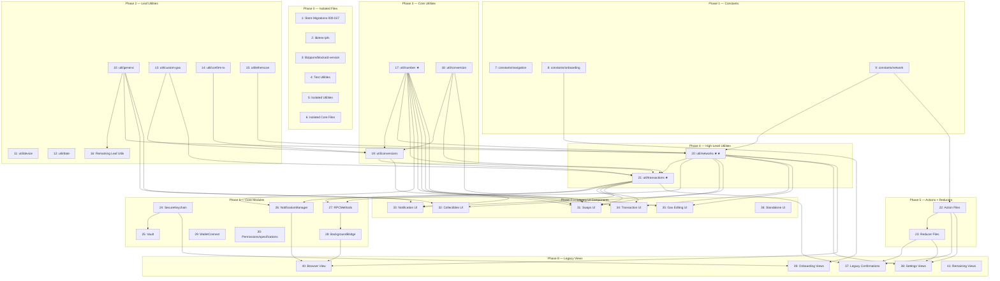

# JS to TS Migration Plan — Epic & Tickets

## Epic: JS to TS Migration — Next Phase

| Field | Value |
|-------|-------|
| **Type** | Epic |
| **Priority** | High |
| **Labels** | `migration`, `typescript`, `tech-debt` |

### Description

Complete the migration of remaining ~260 JavaScript/JSX files in the `app/` directory to TypeScript. The migration is currently ~80% complete. This epic tracks all remaining conversion work, organized by dependency phases to ensure proper ordering.

A CI fitness function already blocks new JS/JSX file additions (`.github/scripts/fitness-functions/rules/javascript-additions.ts`), preventing backsliding. TypeScript configuration (`tsconfig.json`) already has `"strict": true` and `"allowJs": true`, and the Jest configuration already transforms both `.js` and `.ts` via `babel-jest` — no build config changes are needed.

### Key Principles

- **Minimal behavioral changes**: Only add types; do not refactor logic.
- **Keep `connect()` HOCs**: Do not convert to hooks during migration.
- **Preserve preprocessor directives**: `///: BEGIN:ONLY_INCLUDE_IF(...)` must remain intact.
- **Follow existing TS patterns**: Look at already-migrated neighbors for conventions.
- **Snapshot parity**: Snapshot tests must produce identical output after migration.

### Universal Validation Pipeline

Every migrated file must pass:

```bash
# 1. Type check
tsc --noEmit

# 2. Related tests
yarn test --findRelatedTests <migrated-file>

# 3. Lint
yarn lint
```

### Success Criteria

- [ ] All ~260 remaining JS/JSX files in `app/` converted to TS/TSX
- [ ] Zero new `any` types without accompanying `TODO` comments
- [ ] All existing tests pass after migration
- [ ] No new TypeScript errors introduced
- [ ] ESLint passes with no new warnings
- [ ] CI fitness function for JS additions continues to pass

---

## Dependency Diagram



> **Legend**: ★ = High Priority, ★★ = Highest Priority

---

## Parallelism Guide

| Wave | Tickets (can be worked in parallel) | Prerequisite Waves |
|------|-------------------------------------|--------------------|
| **Wave A** | #1, #2, #3, #4, #5, #6, #7, #8, #9, #10, #11, #12, #13, #14, #15 | None |
| **Wave B** | #16, #17, #18, #22 | Wave A (partial: #10 for #16; #9 for #22) |
| **Wave C** | #19, #23, #24, #30 | Wave B (#13, #14, #17, #18 for #19; #22 for #23) |
| **Wave D** | #20, #25 | Wave C (#9, #10, #15, #17 for #20; #24 for #25) |
| **Wave E** | #21, #26, #27, #29 | Wave D (#17-#20 for #21; #17, #21 for #26; #20, #21 for #27) |
| **Wave F** | #28, #31, #32, #33, #34, #35, #36 | Wave E (#27 for #28; #17-#21 for UI) |
| **Wave G** | #37, #38, #39, #40, #41 | Wave F (Phase 5-7 tickets) |

**Maximum theoretical parallelism**: Up to 15 tickets can be in-flight simultaneously in Wave A.

**Recommended team allocation**:
- 3-4 engineers can work continuously across all waves
- Wave A offers the widest parallelism (good for onboarding multiple contributors)
- Waves D-E are the critical path (networks → transactions → downstream)

---

## Tickets

---

### Ticket #1 — Convert Store Migrations 000-027 to TypeScript

| Field | Value |
|-------|-------|
| **Type** | Story |
| **Phase** | Phase 0 — Isolated Files |
| **Complexity** | L (Large) |
| **Dependencies** | None |
| **Labels** | `phase-0`, `migration`, `typescript` |

#### Description

Convert 28 store migration source files (`app/store/migrations/000.js` through `027.js`) and 9 associated test files (`019.test.js` through `027.test.js`) from JavaScript to TypeScript.

Each migration is a self-contained function that transforms persisted Redux state from one schema version to the next. These files have no internal cross-dependencies and can be converted individually or in batches.

**Files to convert (source):**
- `app/store/migrations/000.js` through `app/store/migrations/027.js` (28 files)

**Files to convert (tests):**
- `app/store/migrations/019.test.js` through `app/store/migrations/027.test.js` (9 files)

**Reference pattern:** `app/store/migrations/028.ts` — already migrated, uses `hasProperty`, `isObject` from `@metamask/utils`, and `captureException` from `@sentry/react-native`.

#### Implementation Notes

- Type the function signature as: `export default function migrate(state: unknown): Record<string, unknown>`
- Use `@metamask/utils` type guards (`isObject`, `hasProperty`) for runtime type narrowing (already used in migrations 028+)
- For early migrations (000-018) that access `state.engine.backgroundState.*` directly, add type narrowing guards or type assertions with comments
- Can be split into sub-tasks per migration or done as a batch

#### Acceptance Criteria

- [ ] All 28 source files renamed from `.js` to `.ts`
- [ ] All 9 test files renamed from `.test.js` to `.test.ts`
- [ ] Typed function signatures using `(state: unknown): Record<string, unknown>`
- [ ] Runtime type narrowing with `isObject`/`hasProperty` guards (preferred) or documented type assertions
- [ ] No `any` types unless absolutely necessary (with `TODO` comment)
- [ ] `tsc --noEmit` passes with zero errors
- [ ] `yarn test --findRelatedTests` passes for each migrated file
- [ ] `app/store/migrations/index.test.ts` full pipeline test passes
- [ ] `yarn lint` passes with no new warnings

---

### Ticket #2 — Convert lib/ens-ipfs Files to TypeScript

| Field | Value |
|-------|-------|
| **Type** | Task |
| **Phase** | Phase 0 — Isolated Files |
| **Complexity** | S (Small) |
| **Dependencies** | None |
| **Labels** | `phase-0`, `migration`, `typescript` |

#### Description

Convert 3 ENS/IPFS-related library files from JavaScript to TypeScript. These files contain contract ABI definitions and a resolver utility.

**Files to convert:**
- `app/lib/ens-ipfs/contracts/registry.js`
- `app/lib/ens-ipfs/contracts/resolver.js`
- `app/lib/ens-ipfs/resolver.js`

#### Implementation Notes

- Type contract ABI interfaces
- Type resolver function parameters and return types
- These are leaf files with no downstream JS dependencies

#### Acceptance Criteria

- [ ] All 3 files renamed from `.js` to `.ts`
- [ ] Proper TypeScript types added for contract ABIs and resolver functions
- [ ] No `any` types unless absolutely necessary (with `TODO` comment)
- [ ] `tsc --noEmit` passes with zero errors
- [ ] All existing tests pass
- [ ] `yarn lint` passes with no new warnings

---

### Ticket #3 — Convert lib/ppom/blockaid-version.js to TypeScript

| Field | Value |
|-------|-------|
| **Type** | Task |
| **Phase** | Phase 0 — Isolated Files |
| **Complexity** | S (Small) |
| **Dependencies** | None |
| **Labels** | `phase-0`, `migration`, `typescript` |

#### Description

Convert the single Blockaid version file from JavaScript to TypeScript.

**Files to convert:**
- `app/lib/ppom/blockaid-version.js`

#### Implementation Notes

- Simple constant/version export file
- Trivial rename with type annotations

#### Acceptance Criteria

- [ ] File renamed from `.js` to `.ts`
- [ ] Proper TypeScript types added
- [ ] No `any` types
- [ ] `tsc --noEmit` passes with zero errors
- [ ] All existing tests pass
- [ ] `yarn lint` passes with no new warnings

---

### Ticket #4 — Convert Test Utility Files to TypeScript

| Field | Value |
|-------|-------|
| **Type** | Task |
| **Phase** | Phase 0 — Isolated Files |
| **Complexity** | M (Medium) |
| **Dependencies** | None |
| **Labels** | `phase-0`, `migration`, `typescript` |

#### Description

Convert ~8 test utility files in `app/util/test/` from JavaScript to TypeScript.

**Files to convert:**
- `app/util/test/assetFileTransformer.js`
- `app/util/test/contract-address-registry.js`
- `app/util/test/ganache-seeder.js`
- `app/util/test/ganache.js`
- `app/util/test/network-store.js`
- `app/util/test/smart-contracts.js`
- `app/util/test/testSetup.js`
- `app/util/test/utils.js`

#### Implementation Notes

- These are test infrastructure files, not production code
- Type function parameters and return types
- Type mock objects and test fixture builders

#### Acceptance Criteria

- [ ] All ~8 files renamed from `.js` to `.ts`
- [ ] Proper TypeScript types added for all exported functions and objects
- [ ] No `any` types unless absolutely necessary (with `TODO` comment)
- [ ] `tsc --noEmit` passes with zero errors
- [ ] Full test suite continues to pass (these files are imported by many tests)
- [ ] `yarn lint` passes with no new warnings

---

### Ticket #5 — Convert Isolated Utility Files to TypeScript

| Field | Value |
|-------|-------|
| **Type** | Task |
| **Phase** | Phase 0 — Isolated Files |
| **Complexity** | M (Medium) |
| **Dependencies** | None |
| **Labels** | `phase-0`, `migration`, `typescript` |

#### Description

Convert 6 isolated utility files that have no internal JS dependencies.

**Files to convert:**
- `app/util/sentry/utils.js`
- `app/util/scaling.js`
- `app/util/dapp-url-list.js`
- `app/util/blockies.js`
- `app/util/middlewares.js`
- `app/util/streams.js`

#### Implementation Notes

- Each file is self-contained with only external package dependencies
- Type all exported functions with proper parameter and return types
- Reference already-migrated utils (e.g., `app/util/string/index.ts`) for patterns

#### Acceptance Criteria

- [ ] All 6 files renamed from `.js` to `.ts`
- [ ] Proper TypeScript types added for all exported functions
- [ ] No `any` types unless absolutely necessary (with `TODO` comment)
- [ ] `tsc --noEmit` passes with zero errors
- [ ] `yarn test --findRelatedTests` passes for each migrated file
- [ ] `yarn lint` passes with no new warnings

---

### Ticket #6 — Convert Isolated Core Files to TypeScript

| Field | Value |
|-------|-------|
| **Type** | Task |
| **Phase** | Phase 0 — Isolated Files |
| **Complexity** | M (Medium) |
| **Dependencies** | None |
| **Labels** | `phase-0`, `migration`, `typescript` |

#### Description

Convert 6 isolated core files that have minimal or no internal JS dependencies.

**Files to convert:**
- `app/core/ClipboardManager.js`
- `app/core/DrawerStatusTracker.js`
- `app/core/PreventScreenshot.js`
- `app/core/EntryScriptWeb3.js`
- `app/core/MobilePortStream.js`
- `app/core/TransactionTypes.js`

**Reference patterns:** `app/core/Authentication/Authentication.ts`, `app/core/Encryptor/Encryptor.ts`

#### Implementation Notes

- `TransactionTypes.js` is pure constants — trivial rename
- `DrawerStatusTracker.js` has simple state — straightforward typing
- `ClipboardManager.js` — type the module object; import `Clipboard` types from `@react-native-clipboard/clipboard`
- `PreventScreenshot.js` — create a type declaration for `NativeModules.PreventScreenshot`
- `MobilePortStream.js` — use `Duplex` from `stream` module; type the port interface
- `EntryScriptWeb3.js` — type the module with explicit method signatures

#### Acceptance Criteria

- [ ] All 6 files renamed from `.js` to `.ts`
- [ ] Proper TypeScript types added (typed class fields, method signatures, module interfaces)
- [ ] No `any` types unless absolutely necessary (with `TODO` comment)
- [ ] `tsc --noEmit` passes with zero errors
- [ ] `yarn test --findRelatedTests` passes for each migrated file
- [ ] `yarn lint` passes with no new warnings

---

### Ticket #7 — Convert app/constants/navigation.js to TypeScript

| Field | Value |
|-------|-------|
| **Type** | Task |
| **Phase** | Phase 1 — Constants |
| **Complexity** | S (Small) |
| **Dependencies** | None |
| **Labels** | `phase-1`, `migration`, `typescript` |

#### Description

Convert the navigation constants file from JavaScript to TypeScript. This is a 3-line file — trivial rename. Imported by ~7 TS files.

**Files to convert:**
- `app/constants/navigation.js`

**Reference patterns:** `app/constants/urls.ts`, `app/constants/bridge.ts`

#### Implementation Notes

- Add `as const` assertion for string literal types
- Verify all ~7 TS importers still compile after rename

#### Acceptance Criteria

- [ ] File renamed from `.js` to `.ts`
- [ ] `as const` assertion added for type safety
- [ ] `tsc --noEmit` passes with zero errors
- [ ] All existing tests pass
- [ ] `yarn lint` passes with no new warnings

---

### Ticket #8 — Convert app/constants/onboarding.js to TypeScript

| Field | Value |
|-------|-------|
| **Type** | Task |
| **Phase** | Phase 1 — Constants |
| **Complexity** | S (Small) |
| **Dependencies** | None |
| **Labels** | `phase-1`, `migration`, `typescript` |

#### Description

Convert the onboarding constants file (17 lines) from JavaScript to TypeScript.

**Files to convert:**
- `app/constants/onboarding.js`

#### Implementation Notes

- Add `as const` assertions where appropriate
- Type exported constants

#### Acceptance Criteria

- [ ] File renamed from `.js` to `.ts`
- [ ] Proper TypeScript types / `as const` assertions added
- [ ] `tsc --noEmit` passes with zero errors
- [ ] All existing tests pass
- [ ] `yarn lint` passes with no new warnings

---

### Ticket #9 — Convert app/constants/network.js to TypeScript

| Field | Value |
|-------|-------|
| **Type** | Story |
| **Phase** | Phase 1 — Constants |
| **Complexity** | M (Medium) |
| **Dependencies** | None |
| **Labels** | `phase-1`, `migration`, `typescript` |

#### Description

Convert the network constants file (~105 lines) from JavaScript to TypeScript. This file is imported by ~19 JS files and many TS files. Contains `NETWORKS_CHAIN_ID` enum and all exported network constants.

**Files to convert:**
- `app/constants/network.js`

**Reference patterns:** `app/constants/urls.ts`, `app/constants/bridge.ts`

#### Implementation Notes

- Add proper types for `NETWORKS_CHAIN_ID` enum (use `as const` or `enum`)
- Type all exported constants with string literal types where appropriate
- This is a dependency for many downstream tickets (#20, #22) — prioritize early

#### Acceptance Criteria

- [ ] File renamed from `.js` to `.ts`
- [ ] `NETWORKS_CHAIN_ID` properly typed (enum or `as const` object)
- [ ] All exported constants have explicit types
- [ ] No `any` types
- [ ] `tsc --noEmit` passes with zero errors
- [ ] All existing tests pass (verify all ~19 JS importers and TS importers)
- [ ] `yarn lint` passes with no new warnings

---

### Ticket #10 — Convert app/util/general/index.js to TypeScript

| Field | Value |
|-------|-------|
| **Type** | Story |
| **Phase** | Phase 2 — Leaf Utilities |
| **Complexity** | M (Medium) |
| **Dependencies** | None (only external packages) |
| **Labels** | `phase-2`, `migration`, `typescript` |

#### Description

Convert the general utility file from JavaScript to TypeScript. Has ~27 JS importers.

**Files to convert:**
- `app/util/general/index.js`

**Exported functions:** `tlc`, `timeoutFetch`, `findRouteNameFromNavigatorState`, `capitalize`, `toLowerCaseEquals`

**Reference patterns:** `app/util/string/index.ts`, `app/util/mnemonic/index.ts`

#### Implementation Notes

- Type all function parameters and return types
- Check actual callers to determine correct union types for flexible params
- This file is a dependency for Ticket #16 (ENSUtils)

#### Acceptance Criteria

- [ ] File renamed from `.js` to `.ts`
- [ ] All exported functions have typed parameters and return types
- [ ] No `any` types unless absolutely necessary (with `TODO` comment)
- [ ] `tsc --noEmit` passes with zero errors
- [ ] `yarn test --findRelatedTests` passes
- [ ] `yarn lint` passes with no new warnings

---

### Ticket #11 — Convert app/util/device/index.js to TypeScript

| Field | Value |
|-------|-------|
| **Type** | Task |
| **Phase** | Phase 2 — Leaf Utilities |
| **Complexity** | S (Small) |
| **Dependencies** | None |
| **Labels** | `phase-2`, `migration`, `typescript` |

#### Description

Convert the device/platform detection utility file from JavaScript to TypeScript. Has many importers across the codebase.

**Files to convert:**
- `app/util/device/index.js`

#### Implementation Notes

- Type platform-specific branching using `Platform.OS` literal types (`'ios' | 'android'`)
- Type all exported functions with proper parameter and return types

#### Acceptance Criteria

- [ ] File renamed from `.js` to `.ts`
- [ ] All exported functions have typed parameters and return types
- [ ] Platform-specific branching uses `Platform.OS` literal types
- [ ] No `any` types unless absolutely necessary (with `TODO` comment)
- [ ] `tsc --noEmit` passes with zero errors
- [ ] `yarn test --findRelatedTests` passes
- [ ] `yarn lint` passes with no new warnings

---

### Ticket #12 — Convert app/util/date/index.js to TypeScript

| Field | Value |
|-------|-------|
| **Type** | Task |
| **Phase** | Phase 2 — Leaf Utilities |
| **Complexity** | S (Small) |
| **Dependencies** | None |
| **Labels** | `phase-2`, `migration`, `typescript` |

#### Description

Convert the date formatting utility file from JavaScript to TypeScript.

**Files to convert:**
- `app/util/date/index.js`

**Reference:** `app/util/date/index.test.ts` (already typed — perfect reference for typed util tests)

#### Implementation Notes

- Type `toLocaleDateTime(timestamp: number): string` and similar functions
- Check callers for flexible param types (e.g., `timestamp` as `number | string`)

#### Acceptance Criteria

- [ ] File renamed from `.js` to `.ts`
- [ ] All exported functions have typed parameters and return types
- [ ] No `any` types
- [ ] `tsc --noEmit` passes with zero errors
- [ ] `yarn test --findRelatedTests` passes
- [ ] `yarn lint` passes with no new warnings

---

### Ticket #13 — Convert app/util/custom-gas/index.js to TypeScript

| Field | Value |
|-------|-------|
| **Type** | Task |
| **Phase** | Phase 2 — Leaf Utilities |
| **Complexity** | S (Small) |
| **Dependencies** | None |
| **Labels** | `phase-2`, `migration`, `typescript` |

#### Description

Convert the custom gas constants file from JavaScript to TypeScript. Contains gas unit constants (`ETH`, `GWEI`, `WEI`). Has ~4 JS importers.

**Files to convert:**
- `app/util/custom-gas/index.js`

#### Implementation Notes

- Type gas constants with `as const` for string literal types
- This file is a dependency for Tickets #19 and #21

#### Acceptance Criteria

- [ ] File renamed from `.js` to `.ts`
- [ ] Gas constants typed with `as const` assertions
- [ ] No `any` types
- [ ] `tsc --noEmit` passes with zero errors
- [ ] `yarn test --findRelatedTests` passes
- [ ] `yarn lint` passes with no new warnings

---

### Ticket #14 — Convert app/util/confirm-tx.js to TypeScript

| Field | Value |
|-------|-------|
| **Type** | Task |
| **Phase** | Phase 2 — Leaf Utilities |
| **Complexity** | S (Small) |
| **Dependencies** | None |
| **Labels** | `phase-2`, `migration`, `typescript` |

#### Description

Convert the confirm-tx utility from JavaScript to TypeScript. Contains `formatCurrency` function. Imported by `conversions.js`.

**Files to convert:**
- `app/util/confirm-tx.js`

#### Implementation Notes

- Type `formatCurrency` function parameters and return type
- This file is a dependency for Ticket #19 (conversions)

#### Acceptance Criteria

- [ ] File renamed from `.js` to `.ts`
- [ ] `formatCurrency` function has typed parameters and return type
- [ ] No `any` types unless absolutely necessary (with `TODO` comment)
- [ ] `tsc --noEmit` passes with zero errors
- [ ] `yarn test --findRelatedTests` passes
- [ ] `yarn lint` passes with no new warnings

---

### Ticket #15 — Convert app/util/etherscan.js to TypeScript

| Field | Value |
|-------|-------|
| **Type** | Task |
| **Phase** | Phase 2 — Leaf Utilities |
| **Complexity** | S (Small) |
| **Dependencies** | None |
| **Labels** | `phase-2`, `migration`, `typescript` |

#### Description

Convert the Etherscan URL builder utility from JavaScript to TypeScript. Imported by `networks/index.js`.

**Files to convert:**
- `app/util/etherscan.js`

#### Implementation Notes

- Type URL builder functions with chain ID parameters and string return types
- This file is a dependency for Ticket #20 (networks)

#### Acceptance Criteria

- [ ] File renamed from `.js` to `.ts`
- [ ] All exported functions have typed parameters and return types
- [ ] No `any` types
- [ ] `tsc --noEmit` passes with zero errors
- [ ] `yarn test --findRelatedTests` passes
- [ ] `yarn lint` passes with no new warnings

---

### Ticket #16 — Convert Remaining Leaf Utility Files to TypeScript

| Field | Value |
|-------|-------|
| **Type** | Story |
| **Phase** | Phase 2 — Leaf Utilities |
| **Complexity** | M (Medium) |
| **Dependencies** | Ticket #10 (general) for ENSUtils only |
| **Labels** | `phase-2`, `migration`, `typescript` |

#### Description

Convert remaining leaf utility files from JavaScript to TypeScript.

**Files to convert:**
- `app/util/confusables/index.js`
- `app/util/payment-link-generator.js`
- `app/util/walletconnect.js`
- `app/util/gasUtils.js`
- `app/util/ENSUtils.js` (depends on `general`)
- `app/util/confirmation/signatureUtils.js`

#### Implementation Notes

- `ENSUtils.js` depends on `app/util/general` — convert after Ticket #10 or simultaneously
- For `gasUtils.js`, import `BN` type from `bn.js` for BN.js usage
- Type all exported functions with proper parameter and return types

#### Acceptance Criteria

- [ ] All 6 files renamed from `.js` to `.ts`
- [ ] All exported functions have typed parameters and return types
- [ ] No `any` types unless absolutely necessary (with `TODO` comment)
- [ ] `tsc --noEmit` passes with zero errors
- [ ] `yarn test --findRelatedTests` passes for each migrated file
- [ ] `yarn lint` passes with no new warnings

---

### Ticket #17 — Convert app/util/number/index.js to TypeScript

| Field | Value |
|-------|-------|
| **Type** | Story |
| **Phase** | Phase 3 — Core Utilities |
| **Complexity** | L (Large) |
| **Dependencies** | External packages only (can start immediately; benefits from Phase 2) |
| **Priority** | **HIGH** |
| **Labels** | `phase-3`, `migration`, `typescript`, `high-priority` |

#### Description

Convert the number utility file from JavaScript to TypeScript. This file has **~31 JS importers** and is one of the most-imported utility files in the codebase.

**Files to convert:**
- `app/util/number/index.js`

**Key exported functions:** `hexToBN`, `BNToHex`, `renderFromWei`, `renderFromTokenMinimalUnit`, `weiToFiat`, `toWei`, `isDecimal`, `toBN`, and many more.

#### Implementation Notes

- Import `BN` type from `bn.js` for BigNumber usage
- Type all ~20+ exported functions with proper parameter and return types
- Check actual callers to determine correct union types for flexible parameters (e.g., `value: string | number | BN`)
- This file is a critical dependency for Tickets #19, #20, #21, #26, #31, #33, #34, #35

#### Acceptance Criteria

- [ ] File renamed from `.js` to `.ts`
- [ ] All exported functions have explicit typed parameters and return types
- [ ] `BN` type properly imported and used (not `any`)
- [ ] No `any` types unless absolutely necessary (with `TODO` comment)
- [ ] `tsc --noEmit` passes with zero errors
- [ ] `yarn test --findRelatedTests` passes
- [ ] `yarn lint` passes with no new warnings

---

### Ticket #18 — Convert app/util/conversion/index.js to TypeScript

| Field | Value |
|-------|-------|
| **Type** | Story |
| **Phase** | Phase 3 — Core Utilities |
| **Complexity** | M (Medium) |
| **Dependencies** | External packages only |
| **Labels** | `phase-3`, `migration`, `typescript` |

#### Description

Convert the conversion utility from JavaScript to TypeScript. Has ~10 JS importers. Contains currency conversion functions.

**Files to convert:**
- `app/util/conversion/index.js`

**Key exported functions:** `conversionUtil`, `addCurrencies`, `subtractCurrencies`, `multiplyCurrencies`

#### Implementation Notes

- Type conversion options objects (e.g., `{ fromCurrency, toCurrency, conversionRate, ... }`)
- Type return values based on output denomination options
- This file is a dependency for Tickets #19, #21, #31

#### Acceptance Criteria

- [ ] File renamed from `.js` to `.ts`
- [ ] All exported functions have typed parameters and return types
- [ ] Conversion options objects typed as interfaces
- [ ] No `any` types unless absolutely necessary (with `TODO` comment)
- [ ] `tsc --noEmit` passes with zero errors
- [ ] `yarn test --findRelatedTests` passes
- [ ] `yarn lint` passes with no new warnings

---

### Ticket #19 — Convert app/util/conversions.js to TypeScript

| Field | Value |
|-------|-------|
| **Type** | Story |
| **Phase** | Phase 3 — Core Utilities |
| **Complexity** | M (Medium) |
| **Dependencies** | Tickets #13 (custom-gas), #14 (confirm-tx), #17 (number), #18 (conversion) |
| **Labels** | `phase-3`, `migration`, `typescript` |

#### Description

Convert the conversions utility from JavaScript to TypeScript. Has ~7 JS importers.

**Files to convert:**
- `app/util/conversions.js`

**Key exported functions:** `hexToDecimal`, `decimalToHex`, `getEthConversionFromWeiHex`, and others.

#### Implementation Notes

- Depends on `custom-gas`, `confirm-tx`, `number`, and `conversion` — ensure those are migrated first
- Type hex string parameters as `string` with descriptive parameter names (e.g., `hexValue: string`)
- Type BN.js values appropriately

#### Acceptance Criteria

- [ ] File renamed from `.js` to `.ts`
- [ ] All exported functions have typed parameters and return types
- [ ] No `any` types unless absolutely necessary (with `TODO` comment)
- [ ] `tsc --noEmit` passes with zero errors
- [ ] `yarn test --findRelatedTests` passes
- [ ] `yarn lint` passes with no new warnings

---

### Ticket #20 — Convert app/util/networks/index.js to TypeScript

| Field | Value |
|-------|-------|
| **Type** | Story |
| **Phase** | Phase 4 — High-Level Utilities |
| **Complexity** | L (Large) |
| **Dependencies** | Tickets #9 (constants/network), #10 (general), #15 (etherscan), #17 (number) |
| **Priority** | **HIGHEST** |
| **Labels** | `phase-4`, `migration`, `typescript`, `highest-priority` |

#### Description

Convert the networks utility from JavaScript to TypeScript. This file has **~47 JS importers** — it is the **most-imported JS file in the entire repository**. Contains network detection, chain ID utilities, block explorer URLs, and more.

**Files to convert:**
- `app/util/networks/index.js`

**Key exports:** `NetworkList`, `getAllNetworks`, `isMainNet`, `findBlockExplorerForRpc`, `getNetworkImageSource`, `getDecimalChainId`, and many more.

#### Implementation Notes

- Type `NetworkList` as a strongly-typed constant object
- Type all network utility functions with explicit parameter and return types
- Use chain ID string literal types where possible
- Ensure dependencies (#9, #10, #15, #17) are migrated first
- This is the critical path bottleneck — many Phase 6-8 tickets depend on it

#### Acceptance Criteria

- [ ] File renamed from `.js` to `.ts`
- [ ] `NetworkList` typed as a strongly-typed constant object
- [ ] All exported functions have explicit typed parameters and return types
- [ ] No `any` types unless absolutely necessary (with `TODO` comment)
- [ ] `tsc --noEmit` passes with zero errors
- [ ] `yarn test --findRelatedTests` passes
- [ ] All ~47 JS importers still function correctly
- [ ] `yarn lint` passes with no new warnings

---

### Ticket #21 — Convert app/util/transactions/index.js to TypeScript

| Field | Value |
|-------|-------|
| **Type** | Story |
| **Phase** | Phase 4 — High-Level Utilities |
| **Complexity** | L (Large) |
| **Dependencies** | Tickets #17 (number), #18 (conversion), #19 (conversions), #20 (networks), #13 (custom-gas) |
| **Priority** | **HIGH** |
| **Labels** | `phase-4`, `migration`, `typescript`, `high-priority` |

#### Description

Convert the transactions utility from JavaScript to TypeScript. This is a **large file** with **~31 JS importers** containing transaction formatting, gas calculations, and token transfer parsing.

**Files to convert:**
- `app/util/transactions/index.js`

**Key exports:** Transaction formatting utilities, gas calculation functions, token transfer data encoding/decoding, action key generation.

#### Implementation Notes

- Import transaction types from `@metamask/transaction-controller` (e.g., `TransactionMeta`)
- Type gas value parameters using appropriate numeric types (string hex, BN, number)
- Type token transfer data structures
- All 5 dependencies must be migrated first — this is Phase 4

#### Acceptance Criteria

- [ ] File renamed from `.js` to `.ts`
- [ ] All exported functions have explicit typed parameters and return types
- [ ] Transaction types from `@metamask/transaction-controller` used where applicable
- [ ] No `any` types unless absolutely necessary (with `TODO` comment)
- [ ] `tsc --noEmit` passes with zero errors
- [ ] `yarn test --findRelatedTests` passes
- [ ] `yarn lint` passes with no new warnings

---

### Ticket #22 — Convert All Action Files to TypeScript

| Field | Value |
|-------|-------|
| **Type** | Story |
| **Phase** | Phase 5 — Actions + Reducers |
| **Complexity** | M (Medium) |
| **Dependencies** | Ticket #9 (constants/network) for some action files |
| **Labels** | `phase-5`, `migration`, `typescript` |

#### Description

Convert all 11 Redux action files from JavaScript to TypeScript. Most are <30 lines.

**Files to convert:**
- `app/actions/alert/index.js`
- `app/actions/bookmarks/index.js`
- `app/actions/browser/index.js`
- `app/actions/collectibles/index.js`
- `app/actions/infuraAvailability/index.js`
- `app/actions/modals/index.js`
- `app/actions/notification/index.js`
- `app/actions/privacy/index.js`
- `app/actions/settings/index.js`
- `app/actions/transaction/index.js`
- `app/actions/wizard/index.js`

**Reference pattern:** `app/actions/onboarding/index.ts` — already migrated.

#### Implementation Notes

- Define string literal constants with `as const` for action types
- Define a discriminated union `Action` type for all actions in each module
- Type each action creator's parameters and return type
- Export the `Action` type for use by the corresponding reducer (Ticket #23)

#### Acceptance Criteria

- [ ] All 11 files renamed from `.js` to `.ts`
- [ ] Action type constants defined with `as const`
- [ ] Discriminated union `Action` types exported from each module
- [ ] All action creators have typed parameters and return types
- [ ] No `any` types unless absolutely necessary (with `TODO` comment)
- [ ] `tsc --noEmit` passes with zero errors
- [ ] `yarn test --findRelatedTests` passes for each migrated file
- [ ] `yarn lint` passes with no new warnings

---

### Ticket #23 — Convert All Reducer Files to TypeScript

| Field | Value |
|-------|-------|
| **Type** | Story |
| **Phase** | Phase 5 — Actions + Reducers |
| **Complexity** | M (Medium) |
| **Dependencies** | Ticket #22 (actions), Ticket #9 (constants/network) |
| **Labels** | `phase-5`, `migration`, `typescript` |

#### Description

Convert all 12 Redux reducer files from JavaScript to TypeScript. Should be done after Ticket #22 (actions).

**Files to convert (source):**
- `app/reducers/alert/index.js`
- `app/reducers/bookmarks/index.js`
- `app/reducers/browser/index.js`
- `app/reducers/collectibles/index.js`
- `app/reducers/infuraAvailability/index.js`
- `app/reducers/modals/index.js`
- `app/reducers/notification/index.js`
- `app/reducers/privacy/index.js`
- `app/reducers/settings/index.js`
- `app/reducers/swaps/index.js`
- `app/reducers/transaction/index.js`
- `app/reducers/wizard/index.js`

**Files to convert (tests):**
- `app/reducers/browser/index.test.js`
- `app/reducers/notification/notification.test.js`

**Reference pattern:** `app/reducers/security/index.ts` — follow its pattern of importing `ActionType`, `Action` from actions and defining a `State` interface.

#### Implementation Notes

- Define a `State` interface matching the `initialState` shape for each reducer
- Import the `Action` union type from the corresponding action module (Ticket #22)
- Type the reducer function: `(state: State = initialState, action: Action): State`
- Export the `State` interface for use by selectors and `RootState`

#### Acceptance Criteria

- [ ] All 12 source files renamed from `.js` to `.ts`
- [ ] All 2 test files renamed from `.test.js` to `.test.ts`
- [ ] `State` interface defined and exported for each reducer
- [ ] `Action` union type imported from corresponding action module
- [ ] Reducer functions fully typed
- [ ] No `any` types unless absolutely necessary (with `TODO` comment)
- [ ] `tsc --noEmit` passes with zero errors (including `RootState` compilation)
- [ ] `yarn test --findRelatedTests` passes for each migrated file
- [ ] `yarn lint` passes with no new warnings

---

### Ticket #24 — Convert app/core/SecureKeychain.js to TypeScript

| Field | Value |
|-------|-------|
| **Type** | Task |
| **Phase** | Phase 6 — Core Modules |
| **Complexity** | M (Medium) |
| **Dependencies** | Phase 1 constants |
| **Labels** | `phase-6`, `migration`, `typescript` |

#### Description

Convert the SecureKeychain module from JavaScript to TypeScript. Class-based module wrapping `react-native-keychain`. Imported by 3 TS files.

**Files to convert:**
- `app/core/SecureKeychain.js`

**Reference patterns:** `app/core/Authentication/Authentication.ts`, `app/core/Encryptor/Encryptor.ts`

#### Implementation Notes

- Type the class with `private` fields
- Type `encryptPassword`/`decryptPassword` return types as `Promise<string>`
- Type the singleton pattern
- Import types from `react-native-keychain`
- **External QA recommended**: Manual QA on physical device for biometric auth flows

#### Acceptance Criteria

- [ ] File renamed from `.js` to `.ts`
- [ ] Class fields typed with proper visibility modifiers (`private`, `public`)
- [ ] All method signatures have typed parameters and return types
- [ ] Singleton pattern properly typed
- [ ] No `any` types unless absolutely necessary (with `TODO` comment)
- [ ] `tsc --noEmit` passes with zero errors
- [ ] `yarn test --findRelatedTests` passes
- [ ] `yarn lint` passes with no new warnings

---

### Ticket #25 — Convert app/core/Vault.js to TypeScript

| Field | Value |
|-------|-------|
| **Type** | Task |
| **Phase** | Phase 6 — Core Modules |
| **Complexity** | M (Medium) |
| **Dependencies** | Ticket #24 (SecureKeychain) |
| **Labels** | `phase-6`, `migration`, `typescript` |

#### Description

Convert the Vault module from JavaScript to TypeScript.

**Files to convert:**
- `app/core/Vault.js`

#### Implementation Notes

- Import `KeyringController` types from `@metamask/keyring-controller`
- Type vault operations with proper async return types
- Depends on SecureKeychain being migrated first
- **External QA recommended**: Ledger hardware wallet device needed for integration testing

#### Acceptance Criteria

- [ ] File renamed from `.js` to `.ts`
- [ ] All exported functions have typed parameters and return types
- [ ] `KeyringController` types from `@metamask/keyring-controller` used where applicable
- [ ] No `any` types unless absolutely necessary (with `TODO` comment)
- [ ] `tsc --noEmit` passes with zero errors
- [ ] `yarn test --findRelatedTests` passes
- [ ] `yarn lint` passes with no new warnings

---

### Ticket #26 — Convert app/core/NotificationManager.js to TypeScript

| Field | Value |
|-------|-------|
| **Type** | Task |
| **Phase** | Phase 6 — Core Modules |
| **Complexity** | M (Medium) |
| **Dependencies** | Tickets #17 (number), #21 (transactions) |
| **Labels** | `phase-6`, `migration`, `typescript` |

#### Description

Convert the NotificationManager singleton from JavaScript to TypeScript.

**Files to convert:**
- `app/core/NotificationManager.js`

#### Implementation Notes

- Type the singleton pattern
- Type notification payload interfaces
- Type event handlers and callback signatures
- **External QA recommended**: Manual QA for push notification delivery

#### Acceptance Criteria

- [ ] File renamed from `.js` to `.ts`
- [ ] Singleton pattern properly typed
- [ ] Notification payload interfaces defined
- [ ] All method signatures have typed parameters and return types
- [ ] No `any` types unless absolutely necessary (with `TODO` comment)
- [ ] `tsc --noEmit` passes with zero errors
- [ ] `yarn test --findRelatedTests` passes
- [ ] `yarn lint` passes with no new warnings

---

### Ticket #27 — Convert app/core/RPCMethods/*.js to TypeScript

| Field | Value |
|-------|-------|
| **Type** | Story |
| **Phase** | Phase 6 — Core Modules |
| **Complexity** | L (Large) |
| **Dependencies** | Tickets #20 (networks), #21 (transactions) |
| **Labels** | `phase-6`, `migration`, `typescript` |

#### Description

Convert ~8 RPC method handler files from JavaScript to TypeScript.

**Files to convert (source):**
- `app/core/RPCMethods/index.js`
- `app/core/RPCMethods/eth-request-accounts.js`
- `app/core/RPCMethods/wallet_addEthereumChain.js`
- `app/core/RPCMethods/wallet_switchEthereumChain.js`
- `app/core/RPCMethods/handlers/index.js`
- `app/core/RPCMethods/lib/ethereum-chain-utils.js`
- `app/core/RPCMethods/createEip1193MethodMiddleware/index.js`

**Files to convert (tests):**
- `app/core/RPCMethods/wallet_addEthereumChain.test.js`
- `app/core/RPCMethods/wallet_switchEthereumChain.test.js`
- `app/core/RPCMethods/createEip1193MethodMiddleware/index.test.js`

**Reference patterns:** `app/core/RPCMethods/RPCMethodMiddleware.ts` (already migrated)

#### Implementation Notes

- Import JSON-RPC types from `@metamask/utils`: `JsonRpcRequest`, `PendingJsonRpcResponse`, `JsonRpcParams`
- For each handler, define a `Hooks` interface listing the hook functions it receives
- Type handler functions with standard signature:
  ```typescript
  (req: JsonRpcRequest & { origin: string }, res: PendingJsonRpcResponse<unknown>, next: () => void, end: (err?: Error) => void, hooks: Hooks) => Promise<void>
  ```
- **IMPORTANT**: Preserve `///: BEGIN:ONLY_INCLUDE_IF(preinstalled-snaps,external-snaps)` preprocessor directives exactly as-is

#### Acceptance Criteria

- [ ] All ~8 source files renamed from `.js` to `.ts`
- [ ] All ~3 test files renamed from `.test.js` to `.test.ts`
- [ ] JSON-RPC types imported from `@metamask/utils`
- [ ] `Hooks` interfaces defined for each handler
- [ ] Handler functions typed with standard signatures
- [ ] Preprocessor directives preserved intact
- [ ] No `any` types unless absolutely necessary (with `TODO` comment)
- [ ] `tsc --noEmit` passes with zero errors
- [ ] `yarn test --findRelatedTests` passes for each migrated file
- [ ] `yarn lint` passes with no new warnings

---

### Ticket #28 — Convert app/core/BackgroundBridge/BackgroundBridge.js to TypeScript

| Field | Value |
|-------|-------|
| **Type** | Story |
| **Phase** | Phase 6 — Core Modules |
| **Complexity** | L (Large) |
| **Dependencies** | Ticket #27 (RPCMethods) |
| **Labels** | `phase-6`, `migration`, `typescript` |

#### Description

Convert the BackgroundBridge module from JavaScript to TypeScript. This is the communication bridge between dApps and the wallet.

**Files to convert:**
- `app/core/BackgroundBridge/BackgroundBridge.js`

#### Implementation Notes

- Define a `BackgroundBridgeParams` interface for the constructor
- Type the middleware stack using `@metamask/json-rpc-engine` types
- Type EventEmitter events
- **External QA recommended**: Manual QA for DApp connectivity via WalletConnect/SDK

#### Acceptance Criteria

- [ ] File renamed from `.js` to `.ts`
- [ ] `BackgroundBridgeParams` interface defined for constructor
- [ ] Middleware stack typed using `@metamask/json-rpc-engine` types
- [ ] EventEmitter events typed
- [ ] No `any` types unless absolutely necessary (with `TODO` comment)
- [ ] `tsc --noEmit` passes with zero errors
- [ ] `yarn test --findRelatedTests` passes
- [ ] `yarn lint` passes with no new warnings

---

### Ticket #29 — Convert app/core/WalletConnect/WalletConnect.js to TypeScript

| Field | Value |
|-------|-------|
| **Type** | Task |
| **Phase** | Phase 6 — Core Modules |
| **Complexity** | M (Medium) |
| **Dependencies** | Various Phase 3-4 utilities |
| **Labels** | `phase-6`, `migration`, `typescript` |

#### Description

Convert the WalletConnect v1 module from JavaScript to TypeScript.

**Files to convert:**
- `app/core/WalletConnect/WalletConnect.js`

#### Implementation Notes

- Type session and request objects
- Type event handler signatures
- Reference `app/core/WalletConnect/WalletConnectV2.ts` for patterns (already migrated)

#### Acceptance Criteria

- [ ] File renamed from `.js` to `.ts`
- [ ] Session and request objects typed with interfaces
- [ ] All method signatures have typed parameters and return types
- [ ] No `any` types unless absolutely necessary (with `TODO` comment)
- [ ] `tsc --noEmit` passes with zero errors
- [ ] `yarn test --findRelatedTests` passes
- [ ] `yarn lint` passes with no new warnings

---

### Ticket #30 — Convert app/core/Permissions/specifications.js to TypeScript

| Field | Value |
|-------|-------|
| **Type** | Task |
| **Phase** | Phase 6 — Core Modules |
| **Complexity** | M (Medium) |
| **Dependencies** | External packages mostly |
| **Labels** | `phase-6`, `migration`, `typescript` |

#### Description

Convert the Permissions specifications file from JavaScript to TypeScript.

**Files to convert:**
- `app/core/Permissions/specifications.js`

#### Implementation Notes

- Type caveat/permission specifications using types from `@metamask/permission-controller`
- **IMPORTANT**: Preserve `///: BEGIN:ONLY_INCLUDE_IF(...)` preprocessor directives exactly as-is

#### Acceptance Criteria

- [ ] File renamed from `.js` to `.ts`
- [ ] Permission/caveat specs typed using `@metamask/permission-controller` types
- [ ] Preprocessor directives preserved intact
- [ ] No `any` types unless absolutely necessary (with `TODO` comment)
- [ ] `tsc --noEmit` passes with zero errors
- [ ] `yarn test --findRelatedTests` passes
- [ ] `yarn lint` passes with no new warnings

---

### Ticket #31 — Convert Swaps UI Components to TypeScript

| Field | Value |
|-------|-------|
| **Type** | Story |
| **Phase** | Phase 7 — Legacy UI Components |
| **Complexity** | L (Large) |
| **Dependencies** | Tickets #17 (number), #18 (conversion), #19 (conversions), #20 (networks), #21 (transactions) |
| **Labels** | `phase-7`, `migration`, `typescript` |

#### Description

Convert ~18 Swaps UI component files from JavaScript to TypeScript.

**Files to convert:**
- `app/components/UI/Swaps/index.js` (SwapsAmountView)
- `app/components/UI/Swaps/QuotesView.js`
- `app/components/UI/Swaps/components/ActionAlert.js`
- `app/components/UI/Swaps/components/ApprovalTransactionEditionModal.js`
- `app/components/UI/Swaps/components/AssetSwapButton.js`
- `app/components/UI/Swaps/components/GasEditModal.js`
- `app/components/UI/Swaps/components/LoadingAnimation/backgroundShapes.js`
- `app/components/UI/Swaps/components/LoadingAnimation/index.js`
- `app/components/UI/Swaps/components/Onboarding.js`
- `app/components/UI/Swaps/components/QuotesModal.js`
- `app/components/UI/Swaps/components/QuotesSummary.js`
- `app/components/UI/Swaps/components/SlippageModal.js`
- `app/components/UI/Swaps/components/TokenIcon.js`
- `app/components/UI/Swaps/components/TokenImportModal.js`
- `app/components/UI/Swaps/components/TokenSelectButton.js`
- `app/components/UI/Swaps/components/TokenSelectModal.js`
- `app/components/UI/Swaps/utils/index.js`
- `app/components/UI/Swaps/utils/useBalance.js`
- `app/components/UI/Swaps/utils/useBlockExplorer.js`
- `app/components/UI/Swaps/utils/useFetchTokenMetadata.js`

**Reference patterns:** `app/components/UI/Tokens/index.tsx`, `app/components/UI/ManageNetworks/ManageNetworks.tsx`

#### Implementation Notes

- For `connect()`-based components, define `OwnProps`, `StateProps`, `DispatchProps` interfaces
- Type `mapStateToProps` with `(state: RootState): StateProps`
- Keep `connect()` rather than converting to hooks — minimize behavioral changes
- Replace `PropTypes` with TypeScript interfaces
- Type navigation props using `StackNavigationProp` and `RouteProp`
- **External QA recommended**: Swaps flow should be manually QA'd on device

#### Acceptance Criteria

- [ ] All ~20 files renamed from `.js` to `.tsx` (components) or `.ts` (utils)
- [ ] `PropTypes` replaced with TypeScript `Props` interfaces
- [ ] `connect()` components have `OwnProps`, `StateProps`, `DispatchProps` interfaces
- [ ] Navigation props typed
- [ ] No `any` types unless absolutely necessary (with `TODO` comment)
- [ ] `tsc --noEmit` passes with zero errors
- [ ] `yarn test --findRelatedTests` passes for each migrated file
- [ ] Snapshot tests produce identical output
- [ ] `yarn lint` passes with no new warnings

---

### Ticket #32 — Convert Collectibles UI Components to TypeScript

| Field | Value |
|-------|-------|
| **Type** | Task |
| **Phase** | Phase 7 — Legacy UI Components |
| **Complexity** | M (Medium) |
| **Dependencies** | Tickets #20 (networks), #10 (general) |
| **Labels** | `phase-7`, `migration`, `typescript` |

#### Description

Convert ~6 Collectibles/NFT UI component files from JavaScript to TypeScript.

**Files to convert:**
- Collectibles-related components in `app/components/UI/` that are still `.js`

#### Implementation Notes

- Replace `PropTypes` with TypeScript interfaces
- Type NFT data structures and collection objects
- Type navigation props

#### Acceptance Criteria

- [ ] All collectible component files renamed from `.js` to `.tsx`
- [ ] `PropTypes` replaced with TypeScript `Props` interfaces
- [ ] No `any` types unless absolutely necessary (with `TODO` comment)
- [ ] `tsc --noEmit` passes with zero errors
- [ ] `yarn test --findRelatedTests` passes for each migrated file
- [ ] Snapshot tests produce identical output
- [ ] `yarn lint` passes with no new warnings

---

### Ticket #33 — Convert Notification UI Components to TypeScript

| Field | Value |
|-------|-------|
| **Type** | Task |
| **Phase** | Phase 7 — Legacy UI Components |
| **Complexity** | S (Small) |
| **Dependencies** | Tickets #17 (number), #21 (transactions), #10 (general) |
| **Labels** | `phase-7`, `migration`, `typescript` |

#### Description

Convert ~4 Notification UI component files from JavaScript to TypeScript.

**Files to convert:**
- Notification-related components in `app/components/UI/` that are still `.js`

#### Implementation Notes

- Type notification data structures
- Replace `PropTypes` with TypeScript interfaces
- Type navigation props

#### Acceptance Criteria

- [ ] All notification component files renamed from `.js` to `.tsx`
- [ ] `PropTypes` replaced with TypeScript `Props` interfaces
- [ ] No `any` types unless absolutely necessary (with `TODO` comment)
- [ ] `tsc --noEmit` passes with zero errors
- [ ] `yarn test --findRelatedTests` passes for each migrated file
- [ ] Snapshot tests produce identical output
- [ ] `yarn lint` passes with no new warnings

---

### Ticket #34 — Convert Transaction UI Components to TypeScript

| Field | Value |
|-------|-------|
| **Type** | Story |
| **Phase** | Phase 7 — Legacy UI Components |
| **Complexity** | M (Medium) |
| **Dependencies** | Tickets #17 (number), #20 (networks), #21 (transactions) |
| **Labels** | `phase-7`, `migration`, `typescript` |

#### Description

Convert ~6 Transaction UI component files from JavaScript to TypeScript.

**Files to convert:**
- `app/components/UI/TransactionElement/index.js`
- `app/components/UI/Transactions/index.js`
- Transaction header and related components still in `.js`

#### Implementation Notes

- Import `TransactionMeta` from `@metamask/transaction-controller`
- Type transaction display objects and formatting functions
- Replace `PropTypes` with TypeScript interfaces

#### Acceptance Criteria

- [ ] All transaction component files renamed from `.js` to `.tsx`
- [ ] Transaction types from `@metamask/transaction-controller` used
- [ ] `PropTypes` replaced with TypeScript `Props` interfaces
- [ ] No `any` types unless absolutely necessary (with `TODO` comment)
- [ ] `tsc --noEmit` passes with zero errors
- [ ] `yarn test --findRelatedTests` passes for each migrated file
- [ ] Snapshot tests produce identical output
- [ ] `yarn lint` passes with no new warnings

---

### Ticket #35 — Convert Gas Editing UI Components to TypeScript

| Field | Value |
|-------|-------|
| **Type** | Task |
| **Phase** | Phase 7 — Legacy UI Components |
| **Complexity** | M (Medium) |
| **Dependencies** | Tickets #17 (number), #20 (networks) |
| **Labels** | `phase-7`, `migration`, `typescript` |

#### Description

Convert gas editing UI components from JavaScript to TypeScript.

**Files to convert:**
- `EditGasFee1559` component
- `EditGasFeeLegacy` component
- `TimeEstimateInfoModal` component

#### Implementation Notes

- Type EIP-1559 gas parameters (`maxFeePerGas`, `maxPriorityFeePerGas`)
- Type legacy gas parameters (`gasPrice`)
- Replace `PropTypes` with TypeScript interfaces

#### Acceptance Criteria

- [ ] All gas editing component files renamed from `.js` to `.tsx`
- [ ] Gas parameter types properly defined (EIP-1559 and legacy)
- [ ] `PropTypes` replaced with TypeScript `Props` interfaces
- [ ] No `any` types unless absolutely necessary (with `TODO` comment)
- [ ] `tsc --noEmit` passes with zero errors
- [ ] `yarn test --findRelatedTests` passes for each migrated file
- [ ] Snapshot tests produce identical output
- [ ] `yarn lint` passes with no new warnings

---

### Ticket #36 — Convert Remaining Standalone UI Components to TypeScript

| Field | Value |
|-------|-------|
| **Type** | Story |
| **Phase** | Phase 7 — Legacy UI Components |
| **Complexity** | L (Large) |
| **Dependencies** | Varies; generally Phases 2-4 |
| **Labels** | `phase-7`, `migration`, `typescript` |

#### Description

Convert remaining standalone UI components from JavaScript to TypeScript. Includes components in `app/components/UI/`, `app/components/Base/`, and `app/components/Nav/`.

**Components include (but not limited to):**
- `Navbar`
- `DrawerView`
- `Button`
- `Screen`
- `Confetti`
- Other standalone presentational and stateful components

**Reference patterns:** `app/component-library/components/` — consistent pattern with `Component.tsx`, `Component.types.ts`, `Component.styles.ts`

#### Implementation Notes

- For simple presentational components: replace `PropTypes` with a `Props` interface, convert to typed function component
- For `connect()`-based components: define `OwnProps`, `StateProps`, `DispatchProps` interfaces
- Type `StyleSheet.create()` — either let TS infer or use explicit style types
- Type refs: `useRef<View>(null)`, `useRef<TextInput>(null)`, etc.
- Remove `import PropTypes from 'prop-types'` after conversion

#### Acceptance Criteria

- [ ] All remaining standalone UI component files renamed from `.js` to `.tsx`
- [ ] `PropTypes` replaced with TypeScript `Props` interfaces
- [ ] Components properly typed (function components with `Props`, class components with `Component<Props, State>`)
- [ ] No `any` types unless absolutely necessary (with `TODO` comment)
- [ ] `tsc --noEmit` passes with zero errors
- [ ] `yarn test --findRelatedTests` passes for each migrated file
- [ ] Snapshot tests produce identical output
- [ ] `yarn lint` passes with no new warnings

---

### Ticket #37 — Convert Legacy Confirmations Views to TypeScript

| Field | Value |
|-------|-------|
| **Type** | Story |
| **Phase** | Phase 8 — Legacy Views |
| **Complexity** | L (Large) |
| **Dependencies** | Tickets #21 (transactions), #22 (actions), #23 (reducers), #31-36 (UI components) |
| **Labels** | `phase-8`, `migration`, `typescript` |

#### Description

Convert ~25 files in the legacy confirmations views from JavaScript to TypeScript. This is the **largest and most complex cluster** of files remaining.

**Files to convert (in `app/components/Views/confirmations/legacy/`):**
- `Approval/index.js`
- `Approval/components/TransactionEditor/index.js`
- `Approve/index.js`
- `ApproveView/Approve/index.js`
- `Send/index.js`
- `SendFlow/AddressList/index.js`
- `SendFlow/Amount/index.js`
- `SendFlow/Confirm/index.js`
- `SendFlow/Confirm/components/CustomGasModal/index.js`
- `SendFlow/ErrorMessage/index.js`
- `SendFlow/SendTo/index.js`
- `SendFlow/components/CustomNonceModal/index.js`
- `components/Approval/ApprovalFlowLoader/index.js`
- `components/ApproveTransactionReview/index.js`
- `components/CustomNonce/index.js`
- `components/SignatureRequest/index.js`
- `components/SignatureRequest/ExpandedMessage/index.js`
- `components/TransactionReview/index.js`
- `components/TransactionReview/TransactionReviewData/index.js`
- `components/TransactionReview/TransactionReviewDetailsCard/index.js`
- `components/TransactionReview/TransactionReviewEIP1559/index.js`
- `components/TransactionReview/TransactionReviewEIP1559Update/styles.js`
- `components/TransactionReview/TransactionReviewInformation/index.js`
- `components/TransactionReview/TransactionReviewSummary/index.js`
- `components/TypedSign/index.js`
- `components/WatchAssetRequest/index.js`

**Reference patterns:** `app/components/Views/Wallet/index.tsx`, `app/components/Views/Login/index.tsx`

#### Implementation Notes

- Type transaction objects using `TransactionMeta` from `@metamask/transaction-controller`
- Type approval request objects
- Be careful with `SendFlow` components which pass complex state between screens via navigation params
- For class components: define `Props` and `State` interfaces
- Type navigation params as `RouteParams` types
- **External QA required**: Manual QA for send flow, token approvals, signature requests; Ledger hardware device needed

#### Acceptance Criteria

- [ ] All ~25 files renamed from `.js` to `.tsx`
- [ ] Transaction types from `@metamask/transaction-controller` used
- [ ] All components have typed `Props` and `State` interfaces
- [ ] Navigation params typed
- [ ] `PropTypes` replaced with TypeScript interfaces
- [ ] No `any` types unless absolutely necessary (with `TODO` comment)
- [ ] `tsc --noEmit` passes with zero errors
- [ ] `yarn test --findRelatedTests` passes for each migrated file
- [ ] Snapshot tests produce identical output
- [ ] `yarn lint` passes with no new warnings

---

### Ticket #38 — Convert Settings Views to TypeScript

| Field | Value |
|-------|-------|
| **Type** | Story |
| **Phase** | Phase 8 — Legacy Views |
| **Complexity** | M (Medium) |
| **Dependencies** | Tickets #20 (networks), #22 (actions), #23 (reducers) |
| **Labels** | `phase-8`, `migration`, `typescript` |

#### Description

Convert ~6 Settings view files from JavaScript to TypeScript.

**Files to convert:**
- `app/components/Views/Settings/AdvancedSettings/index.js`
- `app/components/Views/Settings/GeneralSettings/index.js`
- `app/components/Views/Settings/NetworksSettings/index.js`
- `app/components/Views/Settings/Contacts/index.js`
- Additional Settings view files still in `.js` (e.g., `AppInformation`)

#### Implementation Notes

- Type navigation props and route params
- Type settings state from Redux
- Replace `PropTypes` with TypeScript interfaces
- **External QA recommended**: Manual QA for adding/switching networks (Infura API)

#### Acceptance Criteria

- [ ] All Settings view files renamed from `.js` to `.tsx`
- [ ] All components have typed `Props` and `State` interfaces
- [ ] Navigation props typed
- [ ] `PropTypes` replaced with TypeScript interfaces
- [ ] No `any` types unless absolutely necessary (with `TODO` comment)
- [ ] `tsc --noEmit` passes with zero errors
- [ ] `yarn test --findRelatedTests` passes for each migrated file
- [ ] Snapshot tests produce identical output
- [ ] `yarn lint` passes with no new warnings

---

### Ticket #39 — Convert Onboarding Views to TypeScript

| Field | Value |
|-------|-------|
| **Type** | Story |
| **Phase** | Phase 8 — Legacy Views |
| **Complexity** | M (Medium) |
| **Dependencies** | Tickets #8 (constants/onboarding), #24 (SecureKeychain) |
| **Labels** | `phase-8`, `migration`, `typescript` |

#### Description

Convert ~6 Onboarding view files from JavaScript to TypeScript.

**Files to convert:**
- `app/components/Views/ChoosePassword/index.js`
- `app/components/Views/ManualBackupStep1/index.js`
- `app/components/Views/ManualBackupStep2/index.js`
- `app/components/Views/ManualBackupStep3/index.js`
- `app/components/Views/AccountBackupStep1/index.js`
- `app/components/Views/Onboarding/index.js`

#### Implementation Notes

- Type navigation props and route params for the onboarding flow
- Type password/seed phrase state management
- For class components: define `Props` and `State` interfaces
- **External QA required**: Manual QA for biometric setup and seed phrase flows

#### Acceptance Criteria

- [ ] All ~6 files renamed from `.js` to `.tsx`
- [ ] All components have typed `Props` and `State` interfaces
- [ ] Navigation props typed for onboarding flow
- [ ] `PropTypes` replaced with TypeScript interfaces
- [ ] No `any` types unless absolutely necessary (with `TODO` comment)
- [ ] `tsc --noEmit` passes with zero errors
- [ ] `yarn test --findRelatedTests` passes for each migrated file
- [ ] Snapshot tests produce identical output
- [ ] `yarn lint` passes with no new warnings

---

### Ticket #40 — Convert Browser View to TypeScript

| Field | Value |
|-------|-------|
| **Type** | Story |
| **Phase** | Phase 8 — Legacy Views |
| **Complexity** | L (Large) |
| **Dependencies** | Tickets #20 (networks), #26 (NotificationManager), #28 (BackgroundBridge) |
| **Labels** | `phase-8`, `migration`, `typescript` |

#### Description

Convert the Browser view from JavaScript to TypeScript. This is a **large, complex file** handling the dApp browser WebView with wallet injection.

**Files to convert:**
- `app/components/Views/Browser/index.js`

#### Implementation Notes

- Type WebView props and message handlers
- Type navigation state and browser tab management
- Type dApp connection interfaces
- This file has deep dependencies on BackgroundBridge and NotificationManager
- **External QA required**: Manual QA for DApp browsing and transaction signing

#### Acceptance Criteria

- [ ] File renamed from `.js` to `.tsx`
- [ ] WebView props and message handlers typed
- [ ] Navigation state and browser tab management typed
- [ ] Component `Props` and `State` interfaces defined
- [ ] No `any` types unless absolutely necessary (with `TODO` comment)
- [ ] `tsc --noEmit` passes with zero errors
- [ ] `yarn test --findRelatedTests` passes
- [ ] Snapshot tests produce identical output
- [ ] `yarn lint` passes with no new warnings

---

### Ticket #41 — Convert Remaining Views to TypeScript

| Field | Value |
|-------|-------|
| **Type** | Story |
| **Phase** | Phase 8 — Legacy Views |
| **Complexity** | M (Medium) |
| **Dependencies** | Various Phase 6-7 tickets |
| **Labels** | `phase-8`, `migration`, `typescript` |

#### Description

Convert all remaining view files from JavaScript to TypeScript that are not covered by Tickets #37-40.

**Files to convert (include but not limited to):**
- `app/components/Views/Asset/index.js`
- `app/components/Views/Collectible/index.js`
- `app/components/Views/LockScreen/index.js`
- `app/components/Views/ActivityView/index.js`
- `app/components/Views/ErrorBoundary/index.js` (if still JS)
- Other remaining view files

#### Implementation Notes

- For class components: define `Props` and `State` interfaces
- Type navigation props and route params
- Replace `PropTypes` with TypeScript interfaces
- Reference `app/components/Views/Wallet/index.tsx` for patterns

#### Acceptance Criteria

- [ ] All remaining view files renamed from `.js` to `.tsx`
- [ ] All components have typed `Props` and `State` interfaces
- [ ] Navigation props typed
- [ ] `PropTypes` replaced with TypeScript interfaces
- [ ] No `any` types unless absolutely necessary (with `TODO` comment)
- [ ] `tsc --noEmit` passes with zero errors
- [ ] `yarn test --findRelatedTests` passes for each migrated file
- [ ] Snapshot tests produce identical output
- [ ] `yarn lint` passes with no new warnings

---

## Summary Table

| # | Ticket | Phase | Complexity | Dependencies | Priority |
|---|--------|-------|-----------|-------------|----------|
| 1 | Store Migrations 000-027 | 0 | L | None | Normal |
| 2 | lib/ens-ipfs | 0 | S | None | Normal |
| 3 | lib/ppom/blockaid-version | 0 | S | None | Normal |
| 4 | Test Utilities | 0 | M | None | Normal |
| 5 | Isolated Utilities | 0 | M | None | Normal |
| 6 | Isolated Core Files | 0 | M | None | Normal |
| 7 | constants/navigation | 1 | S | None | Normal |
| 8 | constants/onboarding | 1 | S | None | Normal |
| 9 | constants/network | 1 | M | None | Normal |
| 10 | util/general | 2 | M | None | Normal |
| 11 | util/device | 2 | S | None | Normal |
| 12 | util/date | 2 | S | None | Normal |
| 13 | util/custom-gas | 2 | S | None | Normal |
| 14 | util/confirm-tx | 2 | S | None | Normal |
| 15 | util/etherscan | 2 | S | None | Normal |
| 16 | Remaining Leaf Utils | 2 | M | #10 | Normal |
| 17 | util/number | 3 | L | External only | **High** |
| 18 | util/conversion | 3 | M | External only | Normal |
| 19 | util/conversions | 3 | M | #13, #14, #17, #18 | Normal |
| 20 | util/networks | 4 | L | #9, #10, #15, #17 | **Highest** |
| 21 | util/transactions | 4 | L | #17, #18, #19, #20, #13 | **High** |
| 22 | Action Files | 5 | M | #9 | Normal |
| 23 | Reducer Files | 5 | M | #22, #9 | Normal |
| 24 | SecureKeychain | 6 | M | Phase 1 | Normal |
| 25 | Vault | 6 | M | #24 | Normal |
| 26 | NotificationManager | 6 | M | #17, #21 | Normal |
| 27 | RPCMethods | 6 | L | #20, #21 | Normal |
| 28 | BackgroundBridge | 6 | L | #27 | Normal |
| 29 | WalletConnect | 6 | M | Phase 3-4 | Normal |
| 30 | Permissions/specifications | 6 | M | External | Normal |
| 31 | Swaps UI | 7 | L | #17, #18, #19, #20, #21 | Normal |
| 32 | Collectibles UI | 7 | M | #20, #10 | Normal |
| 33 | Notification UI | 7 | S | #17, #21, #10 | Normal |
| 34 | Transaction UI | 7 | M | #17, #20, #21 | Normal |
| 35 | Gas Editing UI | 7 | M | #17, #20 | Normal |
| 36 | Standalone UI | 7 | L | Phases 2-4 | Normal |
| 37 | Legacy Confirmations | 8 | L | #21, #22, #23, #31-36 | Normal |
| 38 | Settings Views | 8 | M | #20, #22, #23 | Normal |
| 39 | Onboarding Views | 8 | M | #8, #24 | Normal |
| 40 | Browser View | 8 | L | #20, #26, #28 | Normal |
| 41 | Remaining Views | 8 | M | Phase 6-7 | Normal |

**Total estimated file count**: ~260 files (source + tests)

## External QA Matrix

| Ticket | External QA / Hardware Needed | Details |
|--------|-------------------------------|---------|
| #1-5 | No | Pure logic, all deps mocked |
| #6 | No | Simple modules, unit-testable |
| #7-16 | No | Constants and leaf utilities |
| #17-21 | No | Pure utility functions |
| #22-23 | No | Redux actions/reducers, pure logic |
| #24 | **Yes** | Biometric auth on physical device |
| #25 | **Yes** | Ledger hardware wallet integration |
| #26 | **Yes** | Push notification delivery |
| #27 | Partial | Build preprocessor verification |
| #28 | **Yes** | DApp connectivity via WalletConnect/SDK |
| #29 | Partial | WalletConnect session management |
| #30 | Partial | Permission specification verification |
| #31 | **Yes** | Swaps flow on device |
| #32-36 | Partial | UI snapshot tests + selective device QA |
| #37 | **Yes** | Send flow, token approvals, Ledger HW |
| #38 | **Yes** | Network adding/switching (Infura API) |
| #39 | **Yes** | Biometric setup, seed phrase flows |
| #40 | **Yes** | DApp browsing, transaction signing |
| #41 | Partial | Selective device QA |
